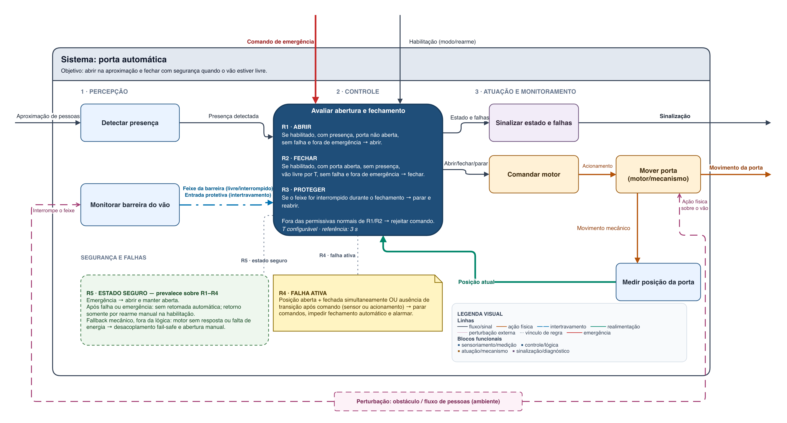
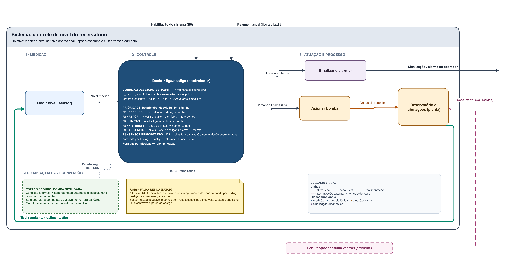
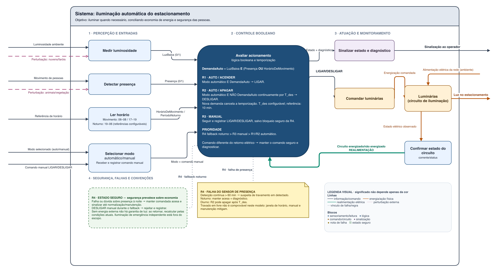
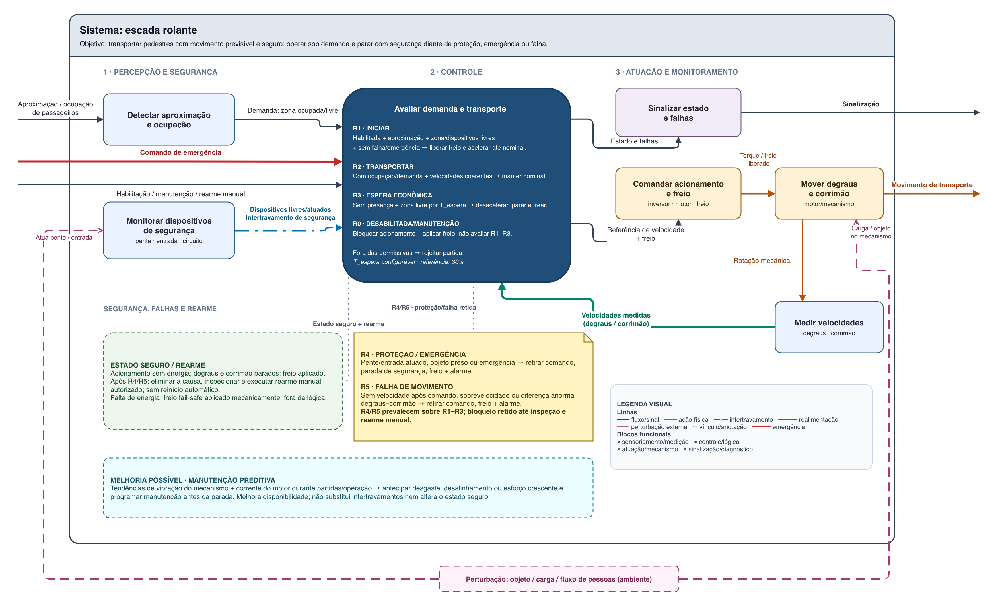

# TP01 — Fundamentos dos Sistemas Automatizados

Atividade prática da Semana 1 da UC Sistemas Automatizados.

## Entregas

| Exercício | Situação no roteiro | Estado | Entrega |
|---|---|---|---|
| Porta automática de acesso a um edifício | Obrigatório | Completo | [`porta-automatica/`](porta-automatica/) |
| Controle de nível de reservatório | Adicional 1 | Completo | [`reservatorio/`](reservatorio/) |
| Iluminação automática de estacionamento | Adicional 2 | Completo | [`iluminacao-estacionamento/`](iluminacao-estacionamento/) |
| Proposta própria: escada rolante | Adicional 3 | Completo | [`escada-rolante/`](escada-rolante/) |

Cada pasta contém o arquivo editável do diagrams.net, a exportação em PNG e um
README com objetivo, classificação, modelo funcional, análise de falhas,
estado seguro e validação por cenários.

## Diagramas

### Porta automática — obrigatório

### Controle de nível do reservatório — adicional 1

### Iluminação automática do estacionamento — adicional 2

### Escada rolante — adicional 3

Os quatro diagramas são autossuficientes: fronteira, objetivo, entradas,
decisões, saídas, realimentação quando aplicável, perturbações, falhas,
respostas seguras e legenda estão registrados no próprio desenho.
