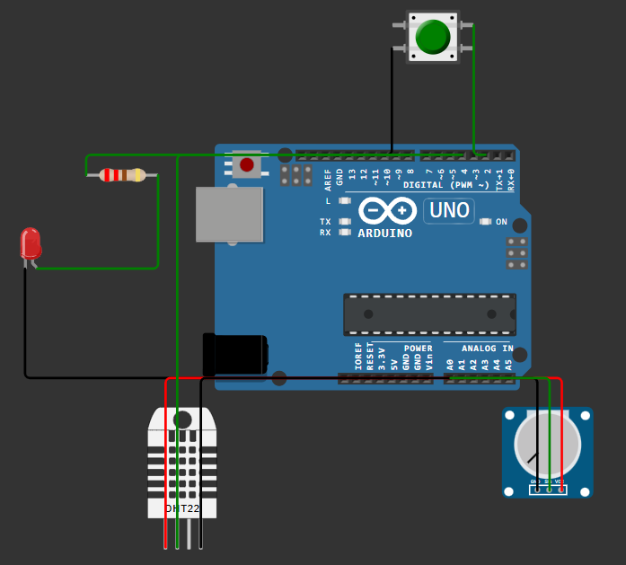

# TP02 — Processos, Sensores e Transdutores

Estação de monitoramento simulada no Wokwi, com Arduino Uno, para a prática da
Semana 2 da UC Sistemas Automatizados.

> **Estado: completo.** Parte obrigatória e exercícios adicionais implementados
> e validados: **57/57 execuções aprovadas**, cobrindo 40 casos distintos
> (21/21 no firmware obrigatório; 36/36 no firmware final, incluindo 17 casos
> repetidos na regressão). O
> registro caso a caso está em
> [`testes/casos-de-teste.md`](testes/casos-de-teste.md) e os mosaicos de
> evidência em [`evidencias/`](evidencias/).

Projeto on-line da etapa obrigatória:
[TP02 - Estacao de monitoramento](https://wokwi.com/projects/473835836746646529).
O firmware final dos adicionais é o [`sketch.ino`](sketch.ino) desta entrega.

**Autor:** Marcelo Antonio Pereira Marcolino — USJT, turma ESO1AN-MCE3.
**Execuções registradas:** 26/08/2026 (etapas manuais no editor do Wokwi) e
02/09/2026 (baterias automatizadas e publicação).

## Objetivo

Adquirir uma entrada digital, uma entrada analógica e uma medição de
temperatura; classificar a condição do processo em **NORMAL**, **ATENÇÃO**,
**ALARME** ou **FALHA DE SENSOR**; e publicar esse estado no Monitor Serial em
formato verificável. Nos adicionais: isolar a classificação em função própria,
acrescentar histerese ao alarme térmico e selecionar equivalentes industriais
para as três entradas.

## Circuito

[](evidencias/circuito.png)

Arquivos desta pasta:

- [`sketch.ino`](sketch.ino) — programa final, com a função de classificação e a
  histerese dos adicionais
- [`diagram.json`](diagram.json) — circuito do Wokwi
- [`libraries.txt`](libraries.txt) — dependências do projeto com as versões
  usadas na validação (DHT sensor library 1.4.7 e Adafruit Unified Sensor
  1.1.15)
- [`testes/casos-de-teste.md`](testes/casos-de-teste.md) — registro completo dos testes
- [`evidencias/`](evidencias/) — evidências da validação, cada uma com um papel:
  - `circuito.png` — montagem completa no editor, com rótulos e ligações
    visíveis;
  - `circuito-em-execucao.png` — o circuito de uma execução real, com o
    cronômetro da simulação, o LED aceso pelo botão pressionado e o serial ao
    fundo (remoção local do cursor do mouse);
  - `monitor-serial.png` — captura do Monitor Serial de uma execução real, com
    remoção local do cursor, mostrando a escada de estados da histerese
    (35 → 40 → 39 → 37 °C: liga na fronteira de 40,0 °C, mantém em 39,0 °C e
    desliga em 37,0 °C);
  - `testes-digitais.png`, `testes-integrados.png`, `prioridade.png` e
    `histerese.png` — mosaicos canônicos, um quadro rotulado por caso, gerados
    do registro serial de cada execução automatizada (wokwi-cli)

## Como executar (reprodução)

1. Abra o [projeto no Wokwi](https://wokwi.com/projects/473835836746646529) —
   ou crie um projeto novo de Arduino Uno e importe `sketch.ino`,
   `diagram.json` e `libraries.txt` desta pasta.
2. Inicie a simulação e acompanhe o Monitor Serial a **9600 baud**: uma linha
   por segundo, no formato fixo descrito abaixo.
3. Interaja com as entradas: clique no botão (o LED em D8 acende e a linha
   passa a `BTN=PRESSIONADO`); gire o potenciômetro (o campo `POT` cruza as
   faixas em 400 e 750); clique no DHT22 e ajuste a temperatura (faixas em
   30 °C e 40 °C, com a histerese do alarme térmico entre 37 °C e 40 °C).
4. Para reproduzir a FALHA DE SENSOR, siga o protocolo de seis passos da seção
   "Provocar a leitura inválida do DHT22".

## Variável, sensor, entrada e resposta

| Variável do processo | Sensor/componente | Entrada no controlador | Resposta do sistema |
|---|---|---|---|
| Acionamento manual (evento discreto) | Pushbutton | D2, digital, com `INPUT_PULLUP` | LED em D8 acende enquanto pressionado |
| Variável analógica contínua | Potenciômetro | A0, analógica, 0–1023 | Contribui para NORMAL/ATENÇÃO/ALARME |
| Temperatura | DHT22 | D4, digital, protocolo próprio | Contribui para o estado; leitura inválida gera FALHA DE SENSOR |

## Ligações

| Componente | Pino | Ligação complementar |
|---|---|---|
| Pushbutton | D2 | outro contato → GND |
| LED + resistor | D8 | D8 → 220 Ω → ânodo; cátodo → GND |
| Potenciômetro | A0 | VCC → 5 V; GND → GND; cursor → A0 |
| DHT22 | D4 | VCC → 5 V; GND → GND; DATA → D4 |

O **GND é comum** a todos os componentes: sem referência elétrica compartilhada
as leituras não têm significado.

## Regras de classificação

| Variável | Normal | Atenção | Alarme |
|---|---|---|---|
| Potenciômetro (valor bruto) | 0–399 | 400–749 | 750–1023 |
| Temperatura | < 30 °C | 30 a < 40 °C | ≥ 40 °C |

A decisão é avaliada em ordem de prioridade, **falha > alarme > atenção >
normal**, pela função `classificar(bruto, t, temperaturaValida)`, que recebe as
medidas e devolve o estado:

1. Leitura de temperatura inválida → **FALHA DE SENSOR**
2. Senão, alarme térmico com histerese **ou** `bruto ≥ 750` → **ALARME**
3. Senão, `t ≥ 30` **ou** `bruto ≥ 400` → **ATENÇÃO**
4. Senão → **NORMAL**

A falha é avaliada primeiro porque uma medida inválida não sustenta uma decisão
de normalidade: se a verificação viesse depois, um sensor mudo com o
potenciômetro em faixa baixa seria reportado como condição normal. O caso P5
(potenciômetro 900 com leitura inválida → FALHA DE SENSOR) comprova essa ordem.

**Histerese do alarme térmico (adicional).** O latch liga quando `t ≥ 40,0 °C`
e só desliga quando `t ≤ 37,0 °C`, sobrevivendo às repetições do `loop()`. O
potenciômetro **não arma nem mantém** o latch (um valor ≥ 750 causa ALARME por
si, mas ao cair abaixo de 750 volta a valer a regra de atenção); durante
leitura inválida o latch **não é atualizado**, conservando o valor que tinha. A
sequência H1–H8 e o ensaio complementar (liga em 40,0; permanece até 37,1;
desliga somente em 37,0) foram validados em execução contínua, com o LED
conferido apagado em cada amostra. A regressão de T1–T7 e F1–F8 confirmou que,
com o latch inicialmente desligado, o comportamento obrigatório não mudou. As
duas invariantes de integração estão explícitas na função `classificar`: uma
leitura inválida retorna antes de atualizar o latch, e o potenciômetro é
consultado depois dessa atualização, sem modificá-lo.

**Sobre o operador entre as duas grandezas.** A tabela do gabarito da atividade
escreve a linha de alarme como `t ≥ 40 °C` **e** `bruto ≥ 750`. A implementação
usa **ou**, por três evidências convergentes: o código de referência do próprio
gabarito, o material da disciplina sobre composição de condições, e os casos de
teste previstos — potenciômetro em 800 com 25 °C, e potenciômetro em 200 com
45 °C — que só produzem alarme com o operador **ou**. Com **e**, uma das duas
grandezas em faixa crítica nunca dispararia o alarme sozinha, o que contraria o
propósito do monitoramento.

## Papel do botão

O pino do botão usa `INPUT_PULLUP`, que liga o resistor interno do
microcontrolador entre o pino e a alimentação. Com o botão solto o circuito fica
aberto e o pino permanece em **HIGH**; ao pressionar, o botão fecha o caminho até
o GND e o pino é puxado para **LOW**. A leitura é, portanto, invertida em relação
à intuição, e por isso o programa compara `digitalRead(BTN) == LOW`.

O botão **controla apenas o LED e não participa da classificação**: o
acionamento manual não altera o estado do processo (caso T6: NORMAL com o LED
aceso).

## Formato da saída serial

Uma linha por ciclo, campos sempre na mesma ordem, a 9600 baud:

```
BTN=<LIBERADO|PRESSIONADO> | POT=<0..1023> | TEMP=<valor, 1 decimal> C | ESTADO=<NORMAL|ATENCAO|ALARME|FALHA DE SENSOR>
```

Com leitura inválida o campo de temperatura vira `TEMP=INVALIDA` e o estado,
`FALHA DE SENSOR`. O formato fixo é o que torna as capturas comparáveis entre si.

## Provocar a leitura inválida do DHT22

Protocolo reprodutível, com a simulação parada nas trocas de fio:

1. Parar a simulação
2. Desconectar o fio de DATA (D4) do DHT22
3. Executar e observar `TEMP=INVALIDA` com `ESTADO=FALHA DE SENSOR`
4. Parar novamente
5. Reconectar o fio de DATA
6. Executar e confirmar o retorno a uma leitura válida

## Estado da validação

| Turno | Firmware | Execuções | Resultado |
|---|---|---|---|
| 26/08 — editor do Wokwi (manual) | etapas 2–5 | D1–D4; F1–F4 (etapa 4); ensaio do DHT22 | Aprovados |
| 02/09 — wokwi-cli (headless) | obrigatório | D1–D4 (expect-pin no LED), T1–T7, F1–F8 no formato serial final, suplementares 401/751 | **21/21 aprovados** — checkpoint congelado |
| 02/09 — wokwi-cli (headless) | final | regressão T1–T7 + F1–F8 + suplementares, P1–P5, H1–H8 + ensaio complementar em execução contínua | **36/36 aprovados** |

Critério de aceite dos casos integrados: a **linha serial completa** esperada,
no formato fixo, com o potenciômetro calibrado até o valor bruto exato e o LED
verificado eletricamente no pino D8. As fronteiras foram atingidas nos valores
exatos (399/400, 749/750, 29,9/30,0, 39,9/40,0). Os mosaicos de
[`evidencias/`](evidencias/) trazem um quadro rotulado por caso, gerado do
registro de cada execução.

## Seleção industrial (adicional 3)

**Processo e mensurandos.** O processo de referência é o monitoramento de uma
câmara térmica de processo: a entrada discreta é a posição da porta da câmara
(porta fechada/aberta, detectada por sensor de processo); a variável
analógica contínua é a pressão da linha de circulação de ar (0–10 bar); e a
temperatura é a do interior da câmara (operação até 100 °C). Para cada
mensurando, o equivalente industrial abaixo compatibiliza faixa, interface,
ambiente e o par falha detectável / não detectável.

### Entrada discreta — pushbutton → chave fim de curso na porta da câmara

- **Equivalente**: chave fim de curso industrial (IEC 60947-5-1) com contatos
  **1 NA + 1 NF, com abertura positiva no contato NF**, atuada pela porta da
  câmara; a alternativa sem contato é um sensor indutivo, quando há alvo
  metálico na porta.
- **Faixa/interface**: dois estados, comutando **24 V CC** em lógica de
  corrente de repouso, com **NA e NF ligados a duas entradas digitais do CLP**
  (IEC 61131-2) e a complementaridade dos canais verificada pela lógica após a
  janela de comutação.
- **Ambiente**: corpo **IP65/IP67** montado no batente, **fora da zona quente
  da câmara**, dentro da faixa térmica típica do componente (−25 a +70 °C),
  resistente a limpeza com jato d'água.
- **Falha detectável**: porta aberta e fio rompido produzem o mesmo estado não
  permissivo — seguro por projeto, mas indistinto por um canal só; o que
  denuncia falha é a **incoerência entre os dois canais** (NA e NF no mesmo
  estado após a janela de comutação), como contato soldado ou cabo rompido de
  um dos canais.
- **Falha não detectável**: chave mecanicamente deslocada do batente que ainda
  comuta — a porta pode não estar efetivamente vedada; não é distinguível
  apenas por essa entrada, exigindo inspeção, teste funcional ou redundância.

### Variável analógica — potenciômetro → transmissor 4–20 mA (laço de corrente)

- **Equivalente**: transmissor de processo a **2 fios, 4–20 mA** alimentado
  pelo laço (pressão da linha de circulação, 0–10 bar), no lugar da tensão 0–5 V
  do divisor resistivo.
- **Faixa/interface**: **4–20 mA** sobre par trançado blindado em entrada
  analógica de CLP (250 Ω → 1–5 V); o "zero vivo" em 4 mA distingue medição
  mínima de laço morto, e a corrente é imune à queda ôhmica do cabo — a razão
  de a faixa de corrente ser preferida à de tensão em planta.
- **Ambiente**: invólucro IP66/IP67, isolação galvânica, proteção contra surto
  em áreas com inversores e cargas chaveadas.
- **Falha detectável**: ruptura do laço ou falha interna leva a corrente para
  fora da faixa útil (< 3,6 mA ou > 21 mA, sinalização NAMUR **NE 43**).
- **Falha não detectável**: **deriva de calibração dentro da faixa** — o valor
  continua plausível; só a calibração periódica contra padrão revela.

### Temperatura — DHT22 → Pt100 a 3 fios com transmissor 4–20 mA

- **Equivalente**: termorresistência **Pt100 classe A (IEC 60751), 3 fios**,
  em poço termométrico, com transmissor de cabeçote convertendo para 4–20 mA.
- **Faixa/interface**: faixa calibrada ajustada ao processo (por exemplo,
  0–100 °C → 4–20 mA), com exatidão de décimos de grau; a ligação a 3 fios
  compensa a resistência do cabo.
- **Ambiente**: poço em aço inox isola o elemento do fluido (troca sem parada
  de processo), cabeçote IP66.
- **Falha detectável**: elemento rompido ou em curto → **burnout** para fora da
  faixa (up-scale/down-scale configurável), reconhecido pelo CLP como falha de
  sensor — o análogo industrial do `TEMP=INVALIDA` desta estação.
- **Falha não detectável**: degradação lenta do elemento ou do contato térmico
  com o poço (leitura amortecida, porém plausível); exige verificação cruzada
  ou calibração periódica.

Nas três escolhas o princípio é o mesmo aplicado no firmware: **a
instrumentação deve tornar a falha franca distinguível da medição legítima**
(contatos duplos, zero vivo, burnout), e o que ela não distingue vira item de
manutenção periódica — a mesma razão pela qual FALHA DE SENSOR tem prioridade
sobre qualquer classificação de normalidade.

## Limitações da simulação

A simulação demonstra a estrutura funcional da aquisição, a prioridade e a
coerência da lógica, a atuação e o diagnóstico no Monitor Serial. Ela **não
valida** alcance, exatidão, repetibilidade, tempo de resposta real, ruído
elétrico, aterramento, compatibilidade eletromagnética, montagem, cabeamento,
invólucro, grau de proteção, calibração metrológica nem segurança funcional.

## Método de construção e validação

Projeto criado do zero no Wokwi, com o circuito montado e o programa da parte
obrigatória construído e testado de forma incremental, etapa a etapa, sem
partir de projeto de terceiros. A validação integrada foi automatizada com o
simulador oficial em modo headless (wokwi-cli v0.26.1) e firmware compilado com
arduino-cli; a integração dos exercícios adicionais ao programa foi confirmada
pela regressão da bateria obrigatória.
