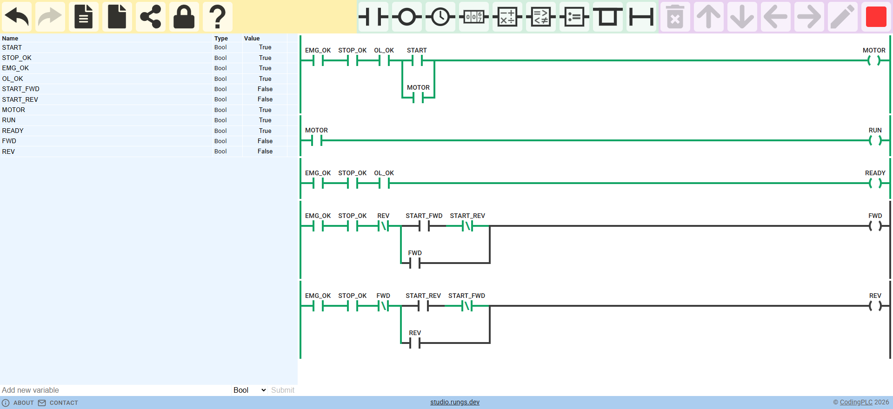
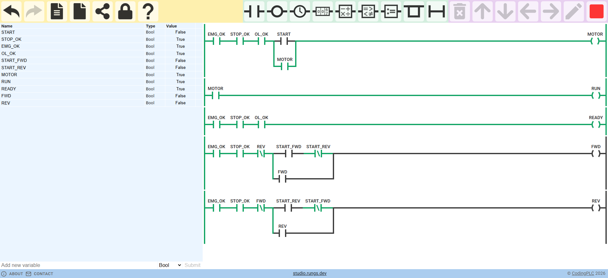
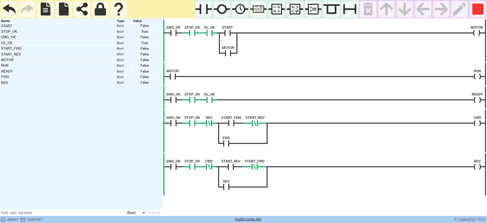

# TP06 — CLP e linguagem Ladder

**Autor:** Marcelo Antonio Pereira Marcolino — USJT — ESO1AN-MCE3<br>
**Estado:** completo — 109/109 passos aprovados no próprio simulador, com conferência independente; link público conferido como visitante sem sessão<br>
**Data:** redação em 6 de outubro de 2026; verificação em 6 de outubro de 2026, 23:25 UTC; link conferido às 23:16 UTC

## Link e artefatos

- Projeto no PLC Simulator Online: <https://app.plcsimulator.online/uYrW5yLXrfxZuFosGd8N>.
  O link abre para visitantes sem login (a conta só é necessária para quem
  compartilha), com `STOP_OK`, `EMG_OK` e `OL_OK` em 1 — parada, emergência e
  sobrecarga saudáveis — e com comandos e saídas em 0. Para testar, ligue a
  simulação (último botão à direita da barra de ferramentas; enquanto ela
  roda, ele aparece como um quadrado vermelho) e clique no contato `START`.
  As entradas do simulador são **alternadas por clique e não voltam
  sozinhas**: depois de partir, clique de novo em `START` para devolvê-lo a 0;
  se ele ficar em 1, liberar STOP religa o motor (F11). O projeto publicado
  não deve ser editado após a entrega.
- [`plc-simulator/diagrama-ladder.json`](plc-simulator/diagrama-ladder.json) —
  backup fiel do programa, no formato nativo do simulador: cinco rungs, 26
  elementos, três ramos e 11 tags booleanas, com `STOP_OK`, `EMG_OK` e `OL_OK`
  gravados em 1. É o arquivo que o ferramental carrega no simulador pela ação
  nativa de importação da aplicação — a mesma que ela usa ao abrir um projeto
  compartilhado — e o que o interpretador independente executa. A interface
  do simulador não oferece importação de arquivo; para o leitor, o caminho até
  o programa em execução é o link.
- [`casos_teste.csv`](casos_teste.csv) — cada passo com condição inicial,
  ação, esperado, obtido e situação, mais as linhas dos invariantes e dos
  mutantes
- [`testes/casos-de-teste.md`](testes/casos-de-teste.md) — relatório legível
  dos casos, invariantes e mutantes; [`testes/resultados.json`](testes/resultados.json)
  — SHA-256 do diagrama, dos casos, dos executores e dos mutantes, com as
  datas UTC da execução nativa e da verificação
- [`evidencias/`](evidencias/) — oito capturas da interface do simulador com
  a simulação ligada (ver *Capturas*)

O JSON versionado (SHA-256
`51df0ea13cd820acae3b5a9c4dc94dce35825f599ac8d94115b8c014d67c973a`) é o que
se importa no simulador e o que o interpretador executa. O link mostra o mesmo
programa, conferido por comparação estrutural e dos valores iniciais (ver
*Validação*).

## Glossário

- **Motor nativo** — o próprio PLC Simulator Online executando o programa; os
  valores "obtidos" vêm dele.
- **Interpretador independente** — programa próprio, escrito à parte, que lê o
  mesmo JSON e executa as mesmas sequências; as duas execuções precisam
  coincidir observação por observação.
- **Mutante** — cópia do programa com um erro introduzido de propósito, que os
  testes precisam reprovar. No `casos_teste.csv`, `PASSA` numa linha de
  mutante significa que o programa errado foi reprovado onde devia.

## Objetivo

Construir no PLC Simulator Online o circuito de partida e parada de motor com
contato de selo, usando tags com nome e função, e mostrar por testes que a
parada, a emergência e a sobrecarga interrompem a retenção, que o motor
permanece ligado depois de soltar START e que, com START previamente solto,
a retomada exige uma nova partida. Com START mantido, a volta dos permissivos
religa o motor — comportamento declarado e testado (F11, F14, F16). Como adicionais, o mesmo programa traz as lâmpadas `RUN` e `READY` e
uma reversão de sentido intertravada. O README relaciona ainda cada rung com a
equação booleana e com o equivalente em Structured Text.

## Plataforma

- **PLC Simulator Online** (`app.plcsimulator.online`), a plataforma pedida
  pelo enunciado da Semana 6. O autor da ferramenta declara na própria página
  que não a desenvolve mais e indica como sucessor o *studio.rungs.dev*; o
  simulador continua funcional e foi usado como pedido.
- A contingência prevista (Virtual Labs) não foi necessária.
- Extensões do VS Code foram pesquisadas: nenhuma edita ou executa diagramas
  deste simulador. As de Structured Text existentes não foram necessárias,
  porque o equivalente em ST aparece aqui apenas como documentação da relação
  entre linguagens, sem execução.

## Atividade 1 — elementos do Ladder

| Elemento | O que é | Onde aparece neste programa |
|---|---|---|
| Trilhos | as duas linhas verticais que delimitam o diagrama: a da esquerda é a fonte lógica de "energia", a da direita é o retorno | um rung só conduz se houver um caminho de contatos fechados entre os dois. No estado em que o link abre (permissivos em 1, `START` e `MOTOR` em 0), há caminho no R3 — os três NA fechados levam `READY` a 1 na primeira varredura — e não há no R1, porque os dois caminhos do ramo, `START` e o selo `MOTOR`, estão abertos; `MOTOR` fica em 0 |
| Rung | uma linha horizontal que calcula **uma** saída a partir de uma condição; o CLP avalia os rungs de cima para baixo | o R1 calcula `MOTOR`; o R2, `RUN`; o R3, `READY`; o R4 e o R5, `FWD` e `REV` |
| Contato | teste de uma tag booleana. O normalmente aberto (NA, `XIC`) conduz quando a tag vale 1; o normalmente fechado (NF, `XIO`) conduz quando a tag vale 0 | no R1, o contato NA `STOP_OK` conduz enquanto a cadeia de parada está saudável (`STOP_OK = 1`, botão de parada não pressionado) e abre na varredura em que STOP é pressionado; no R4, o NF `REV` só conduz se o retorno estiver desligado |
| Ramo | dois ou mais caminhos em paralelo dentro do mesmo rung: basta um deles conduzir (OU lógico) | no R1, o ramo `START ∥ MOTOR`: ao pressionar START, o caminho de cima conduz; depois de soltar START, é o caminho de baixo — o contato `MOTOR`, de selo — que mantém a continuidade enquanto os três permissivos estiverem fechados |
| Bobina | a saída do rung (`OTE`): recebe 1 se houver continuidade até ela e 0 caso contrário, a cada varredura | a bobina `MOTOR` no fim do R1; a mesma tag `MOTOR` é lida como contato de selo no R1 e como condição do R2 |

Contatos em série significam E: todos precisam conduzir. Por isso, no R1,
basta um dos três permissivos abrir para a bobina `MOTOR` ir a 0, qualquer que
seja o caminho do ramo.

## Tabela de E/S

| Tag | Tipo | Significado | Valor 1 significa |
|---|---|---|---|
| `START` | entrada | botão que pede a partida do motor | botão pressionado |
| `STOP_OK` | entrada | permissivo de parada: o circuito do botão de parada está íntegro e não foi acionado | parada não pedida |
| `EMG_OK` | entrada | permissivo de emergência: o dispositivo de emergência está em repouso | emergência não acionada |
| `OL_OK` | entrada | permissivo térmico: o relé de sobrecarga do motor não atuou | sem disparo |
| `START_FWD` | entrada | botão que pede marcha no sentido direto (adicional 2) | botão pressionado |
| `START_REV` | entrada | botão que pede marcha no sentido inverso (adicional 2) | botão pressionado |
| `MOTOR` | saída | comando da bobina do contator do motor | contator comandado |
| `RUN` | saída | sinaleiro de motor em operação (adicional 1) | `MOTOR` em 1 |
| `READY` | saída | sinaleiro de pronto para partir (adicional 1) | os três permissivos em 1 |
| `FWD` | saída | comando do contator do sentido direto (adicional 2) | contator comandado |
| `REV` | saída | comando do contator do sentido inverso (adicional 2) | contator comandado |

**Convenção `*_OK`.** As entradas terminadas em `_OK` são permissivos em
lógica positiva: 1 significa **saudável**. Assim, `STOP_OK = 1` é o estado
normal, e pressionar STOP leva a tag a 0. Por isso esses permissivos aparecem
no Ladder como **contatos NA**: o contato conduz enquanto a cadeia está
saudável. Isso é convenção lógica da tag, não a mecânica do botão: o botão de
parada físico continua sendo, tipicamente, um contato NF ligado à entrada do
CLP — a entrada fica em 1 com o botão em repouso, e um fio rompido também
leva a 0, ou seja, à parada. O "NA" do Ladder testa o **valor** da tag, não
descreve o dispositivo de campo.

## Programa

Um diagrama, cinco rungs, avaliados na ordem R1 → R5:

| Rung | Atividade | Equação | Ordem dos elementos |
|---|---|---|---|
| R1 | obrigatório | `MOTOR = EMG_OK · STOP_OK · OL_OK · (START + MOTOR)` | NA `EMG_OK`, NA `STOP_OK`, NA `OL_OK`, ramo `START ∥ MOTOR`, bobina `MOTOR` |
| R2 | adicional 1 | `RUN = MOTOR` | NA `MOTOR`, bobina `RUN` |
| R3 | adicional 1 | `READY = EMG_OK · STOP_OK · OL_OK` | três NA em série, bobina `READY` |
| R4 | adicional 2 | `FWD = EMG_OK · STOP_OK · ¬REV · ((START_FWD · ¬START_REV) + FWD)` | NA `EMG_OK`, NA `STOP_OK`, NF `REV`, ramo `(START_FWD · ¬START_REV) ∥ FWD`, bobina `FWD` |
| R5 | adicional 2 | `REV = EMG_OK · STOP_OK · ¬FWD · ((START_REV · ¬START_FWD) + REV)` | simétrico ao R4 |

Por que essa ordem:

- **Permissivos antes do ramo de selo.** `EMG_OK`, `STOP_OK` e `OL_OK` estão
  em série *antes* do ramo, e não dentro de um dos caminhos. Assim, qualquer
  permissivo em 0 corta os dois caminhos — o de START e o de selo — e a
  retenção cai. Se `STOP_OK` estivesse só no caminho de START, o selo
  manteria o motor ligado mesmo com STOP pressionado; é exatamente o erro do
  mutante MUT-A, que os testes reprovam.
- **`OL_OK` no rung do motor.** O enunciado da Semana 6 trabalha com quatro
  tags de entrada (START, STOP_OK, EMG_OK, OL_OK), e os testes de falha
  simulam sobrecarga. `EMG_OK` e `STOP_OK` vêm primeiro, como no passo a passo
  de construção do rung; `OL_OK` vem em seguida. A ordem entre contatos em
  série não muda o resultado lógico, só a leitura.
- **R2 depois de R1.** `RUN` lê `MOTOR` já atualizado na mesma varredura, por
  isso as duas tags nunca divergem ao fim de uma varredura. Com a ordem
  invertida, `RUN` passaria a mostrar o `MOTOR` da varredura anterior
  (mutante MUT-D).
- **Adicional 2 como um segundo acionamento.** R4 e R5 representam um
  acionamento reversível no mesmo painel: compartilham a cadeia de parada e de
  emergência (`STOP_OK`, `EMG_OK`), mas não usam `OL_OK`, que é a sobrecarga
  do motor do R1. Um acionamento real teria sobrecarga própria (ver limites).
  Como `STOP_OK` é comum, parar o acionamento reversível para inverter o
  sentido também desliga o motor do R1.

Equivalente em Structured Text (IEC 61131-3), como relação entre linguagens —
documentação, não executado:

```
MOTOR := EMG_OK AND STOP_OK AND OL_OK AND (START OR MOTOR);
RUN   := MOTOR;
READY := EMG_OK AND STOP_OK AND OL_OK;
FWD   := EMG_OK AND STOP_OK AND NOT REV AND ((START_FWD AND NOT START_REV) OR FWD);
REV   := EMG_OK AND STOP_OK AND NOT FWD AND ((START_REV AND NOT START_FWD) OR REV);
```

Cada linha de ST é um rung: série vira `AND`, ramo paralelo vira `OR`,
contato NF vira `NOT`, e a atribuição corresponde à bobina. A ordem das linhas
é a ordem de varredura, e a dependência de `RUN` em relação a `MOTOR` vale
também em ST.

## Hipóteses e critérios de segurança

Resumo das hipóteses espalhadas pelas seções; o detalhe está em cada uma.

- **Permissivos em lógica positiva (`*_OK`).** 1 é saudável; por isso entram
  como contatos NA, e uma entrada em 0 — botão acionado ou fio rompido — leva
  à parada (*Tabela de E/S*).
- **Estado de partida.** O projeto abre com os três permissivos em 1 e com
  comandos e saídas em 0; nenhuma saída liga sem um comando de partida.
- **Permissivos antes do selo.** `EMG_OK`, `STOP_OK` e `OL_OK` em série antes
  do ramo cortam tanto a partida quanto a retenção (*Programa*; MUT-A).
- **Partida por nível, declarada.** Com o botão de partida mantido, a volta de
  qualquer permissivo religa na varredura seguinte (F11, F14, F16; V17); a
  melhoria é a partida por borda (*Testes de falha e retomada*).
- **Política de reversão.** Nunca os dois sentidos ao mesmo tempo (INV-REV);
  comandos simultâneos a partir do repouso não partem nenhum sentido; com um
  sentido em marcha, o comando oposto é ignorado; inverter exige passar pelo
  comando de parada, sem garantia de que o motor parou (*Adicional 2*).
- **R4 e R5 sem `OL_OK`.** O acionamento reversível compartilha parada e
  emergência, mas não a sobrecarga do motor do R1; por isso `READY` indica
  prontidão apenas para `MOTOR`.
- **Emergência não é função de segurança.** `EMG_OK` só bloqueia o comando no
  programa; uma emergência real exige dispositivo e circuito de segurança
  próprios (*Conclusão e limites da simulação*).

## Exercício obrigatório — partida com selo

O R1 é o exercício obrigatório. Com tudo saudável e `MOTOR = 0`, pressionar
START fecha o caminho de cima do ramo e a bobina vai a 1 (T01). Na varredura
seguinte, o contato `MOTOR` do caminho de baixo já está fechado, e soltar
START não muda nada: o motor continua ligado pelo selo (T02). Pressionar STOP
leva `STOP_OK` a 0, abre a série antes do ramo e derruba a bobina; como
`MOTOR` agora é 0, o selo também se abre (T03). A emergência faz o mesmo por
`EMG_OK` (T04), e com a emergência acionada START não consegue partir (T05).

| ID | Condição inicial | Ação | Esperado | Obtido | Situação |
|---|---|---|---|---|---|
| T01 | tudo saudável, `MOTOR = 0` | pressionar START (`START = 1`) | `MOTOR = 1` | `MOTOR = 1` | PASSA |
| T02 | `MOTOR = 1` | soltar START (`START = 0`) | `MOTOR = 1` | `MOTOR = 1` | PASSA |
| T03 | `MOTOR = 1` | pressionar STOP (`STOP_OK = 0`) | `MOTOR = 0` | `MOTOR = 0` | PASSA |
| T04 | `MOTOR = 1` | acionar emergência (`EMG_OK = 0`) | `MOTOR = 0` | `MOTOR = 0` | PASSA |
| T05 | `MOTOR = 0`, `EMG_OK = 0` | pressionar START (`START = 1`) | `MOTOR = 0` | `MOTOR = 0` | PASSA |

Além da tabela obrigatória, o programa reproduz a tabela de estados de
referência (M01–M06), em que M03 é 1 pelo selo, e o traço de referência
(TR0–TR4), que confere também o valor de `MOTOR` imediatamente antes de cada
varredura. O esperado e o obtido desses passos estão em
[`casos_teste.csv`](casos_teste.csv); todos passam.

## Testes de falha e retomada

| ID | Condição | Ação | Esperado | Obtido | Situação | O que demonstra |
|---|---|---|---|---|---|---|
| F01 | `MOTOR = 1` | sobrecarga dispara (`OL_OK = 0`) | `MOTOR = 0` | `MOTOR = 0` | PASSA | a falha remove a retenção |
| F02 | `MOTOR = 0`, `OL_OK = 0` | pressionar START (`START = 1`) | `MOTOR = 0` | `MOTOR = 0` | PASSA | a falha impede a partida |
| F03 | `MOTOR = 0`, `START = 1`, `OL_OK = 0` | soltar START e rearmar a sobrecarga (`START = 0`, `OL_OK = 1`) | `MOTOR = 0` | `MOTOR = 0` | PASSA | rearmar, com START solto, não religa |
| F04 | `MOTOR = 0`, tudo saudável | nova partida (`START = 1`) | `MOTOR = 1` | `MOTOR = 1` | PASSA | a retomada vem de uma nova ação de START |
| F05 | `MOTOR = 1` | soltar START (`START = 0`) | `MOTOR = 1` | `MOTOR = 1` | PASSA | o selo volta a funcionar após a falha |
| F06 | `MOTOR = 1` | acionar emergência (`EMG_OK = 0`) | `MOTOR = 0` | `MOTOR = 0` | PASSA | a emergência interrompe o selo |
| F07 | `MOTOR = 0`, `EMG_OK = 0` | liberar emergência (`EMG_OK = 1`) | `MOTOR = 0` | `MOTOR = 0` | PASSA | liberar, com START solto, não religa |
| F08 | `MOTOR = 0`, tudo saudável | nova partida (`START = 1`) | `MOTOR = 1` | `MOTOR = 1` | PASSA | retomada por START |
| F09 | tudo saudável, `MOTOR = 0` | pressionar e manter START (`START = 1`) | `MOTOR = 1` | `MOTOR = 1` | PASSA | partida normal |
| F10 | `MOTOR = 1`, `START = 1` | pressionar STOP com START mantido (`STOP_OK = 0`) | `MOTOR = 0` | `MOTOR = 0` | PASSA | a parada vence START mantido |
| F11 | `MOTOR = 0`, `START = 1`, `STOP_OK = 0` | soltar STOP com START mantido (`STOP_OK = 1`) | `MOTOR = 1` | `MOTOR = 1` | PASSA | partida por nível (abaixo) |
| F12 | tudo saudável, `MOTOR = 0` | pressionar e manter START (`START = 1`) | `MOTOR = 1` | `MOTOR = 1` | PASSA | partida normal |
| F13 | `MOTOR = 1`, `START = 1` | acionar emergência com START mantido (`EMG_OK = 0`) | `MOTOR = 0` | `MOTOR = 0` | PASSA | a emergência vence START mantido |
| F14 | `MOTOR = 0`, `START = 1`, `EMG_OK = 0` | liberar emergência com START mantido (`EMG_OK = 1`) | `MOTOR = 1` | `MOTOR = 1` | PASSA | partida por nível (abaixo) |
| F15 | `MOTOR = 1`, `START = 1` | sobrecarga dispara com START mantido (`OL_OK = 0`) | `MOTOR = 0` | `MOTOR = 0` | PASSA | a sobrecarga vence START mantido |
| F16 | `MOTOR = 0`, `START = 1`, `OL_OK = 0` | rearmar a sobrecarga com START mantido (`OL_OK = 1`) | `MOTOR = 1` | `MOTOR = 1` | PASSA | partida por nível (abaixo) |

**F11, F14 e F16 registram comportamento declarado, não defeito.** A partida
deste circuito é por **nível**: o caminho de START conduz enquanto o botão
está pressionado. Por isso, com o botão de partida mantido, a volta de
**qualquer** permissivo — soltar STOP (F11), liberar a emergência (F14) ou
rearmar a sobrecarga (F16) — religa o motor na varredura seguinte. F03 e F07
passam porque o botão de partida já está solto quando o permissivo volta (em
F03 ele é solto no mesmo passo do rearme; em F07, no preparo da sequência).
Na reversão vale o mesmo: um botão de sentido mantido parte ao liberar STOP
(V17, em *Adicional 2*). Os testes fixam esse comportamento para que ele seja
conhecido, e não uma surpresa.

Numa máquina real ele não é aceitável: o rearme da emergência não pode, por
si só, provocar uma partida, e um botão travado ou mantido não deveria religar
nada. A melhoria concreta é a partida por **borda**: trocar o NA de `START`
pelo contato de transição positiva (OSP, *one shot*) que o próprio simulador
oferece, de modo que só a passagem de 0 para 1 conte como comando; ou aceitar
START somente depois que todos os permissivos estiverem estáveis em 1.

## Divergências e correções

**Na execução final, nenhuma.** O obtido coincidiu com o esperado em todos os
109 passos verificados (109/109), e o motor nativo e o interpretador
independente produziram observações idênticas em 905 de 905 (181 por
programa, no original e nos quatro mutantes).

**Durante o trabalho**, estas divergências apareceram e foram corrigidas:

- **Capturas repetidas.** As capturas de parada e de READY saíram idênticas
  byte a byte, porque as duas sequências terminavam no mesmo estado. A de
  READY passou a mostrar a sobrecarga isolada (RD04).
- **Valores iniciais do programa.** A primeira versão do arquivo gravava todas
  as tags em 0, e o link abriria com os permissivos desligados. O arquivo
  passou a gravar `STOP_OK`, `EMG_OK` e `OL_OK` em 1, e a conferência do link
  compara os valores iniciais com os do JSON.
- **Partida por nível só declarada para o STOP.** A revisão apontou que o
  README só registrava o religamento por nível ao liberar STOP. Foram
  acrescentados F12–F16 e V13–V17, que fixam o mesmo comportamento para a
  emergência, a sobrecarga e a reversão.
- **Condições com "M".** A revisão apontou que as condições iniciais usavam a
  abreviação "M" em vez da tag `MOTOR`. Todas passaram a usar `MOTOR`, e F03 e
  F11 ganharam a condição completa (`START = 1` em F03; `STOP_OK = 0` em F11).
- **Fim de linha de um arquivo de ferramenta.** Um arquivo do ferramental
  copiado de outra atividade tinha terminações CRLF, o que mudaria seu hash
  num clone. Ele foi normalizado para LF, e a regra foi fixada no
  `.gitattributes`.

## Adicional 1 — RUN e READY

- `RUN = MOTOR` (R2): acende quando o CLP está **comandando** o contator. Os
  testes RN01–RN04 mostram `RUN` acompanhando `MOTOR` na partida, no selo, na
  parada e depois de soltar STOP, e o invariante INV-RUN confere a igualdade
  ao fim de toda varredura de todas as sequências.
- `READY = EMG_OK · STOP_OK · OL_OK` (R3): acende quando os três permissivos
  estão saudáveis, ou seja, quando uma partida de `MOTOR` seria aceita. Não
  vale para o acionamento reversível: `FWD` e `REV` não usam `OL_OK` e podem
  partir com `READY` apagado apenas pela sobrecarga. RD01–RD08 percorrem a
  tabela-verdade completa dos três permissivos (cada um removido sozinho, em
  pares e os três juntos); o invariante INV-RDY confere a equação em toda
  varredura.

**RUN indica comando, não movimento.** A bobina `RUN` só repete a decisão do
programa. Se o contator não fechar (bobina queimada, fusível aberto), se o
motor travar ou se o acoplamento romper, `RUN` continua aceso. Comprovar
movimento real exigiria uma realimentação do campo: no mínimo um contato
auxiliar do contator ligado a uma entrada do CLP (comprova que o contator
fechou) e, para provar rotação, um sensor no eixo ou na carga (sensor de
rotação, de velocidade ou de fluxo), com uma lógica de discrepância que
sinalize falha se `MOTOR = 1` e a realimentação não chegar em um tempo
definido.

## Adicional 2 — reversão intertravada

R4 e R5 comandam `FWD` e `REV` com três proteções:

1. **Intertravamento por estado:** o NF `REV` em série no R4 (e o NF `FWD` no
   R5) impede que um sentido seja comandado enquanto o outro está ativo.
2. **Bloqueio de comandos simultâneos:** no caminho de partida, `START_FWD`
   só conta com `START_REV` em 0, e vice-versa.
3. **Cadeia comum de parada e emergência:** `EMG_OK` e `STOP_OK` antes do
   ramo, como no R1.

**Política de simultaneidade.** A partir do repouso, `START_FWD` e
`START_REV` pressionados juntos **não partem nenhum sentido** (V10). Ao soltar
um dos dois, o outro, ainda pressionado, parte (V11) — consequência da
partida por nível. Com um sentido em marcha, o comando oposto é **ignorado**,
mesmo pressionado junto com o do próprio sentido (V03, V12). O bloqueio
`¬START_oposto` fica só no caminho de partida, e não antes do ramo, para que
segurar o botão oposto não derrube o sentido que já está em marcha.

Entre as alternativas sem memória, essa é a mais conservadora. Deixar só os
NF de estado (`¬REV` no R4, `¬FWD` no R5) faria um comando simultâneo a
partir do repouso ligar o sentido cujo rung vem primeiro: o resultado
dependeria da ordem dos rungs, uma dependência que o diagrama não mostra.
Uma prioridade fixa (por exemplo, `¬START_FWD` só no R5) não dependeria da
ordem, mas escolheria um sentido pelo operador. Por isso nenhum sentido parte.
Ir além — exigir que os dois botões voltem a 0 antes de aceitar nova partida —
pediria memória ou partida por borda.

**Reversão exige parar.** Para passar de avanço para retorno, o operador
pressiona STOP (V04), solta (V05) e pressiona `START_REV` (V06). O programa
impõe a passagem pelo comando de parada, mas **não impõe um novo
acionamento**: se `START_REV` já estiver pressionado durante o avanço, ele é
ignorado enquanto `FWD` está em marcha (V15), e um toque em STOP basta para
`REV` partir ao liberar STOP, sem novo comando (V16, V17). O programa também
**não garante que o motor parou**: "parar" aqui é só o comando — não há
temporização de espera entre sentidos nem sensor de rotação zero, e a
inversão pode acontecer com o eixo ainda girando por inércia. Exigir STOP
torna a inversão uma decisão explícita; evitar o pico de corrente e o esforço
mecânico de inverter um motor em movimento exige, numa reversão real, espera
entre sentidos (temporizador TON) ou sensor de rotação zero, além do
intertravamento elétrico ou mecânico entre os contatores. A emergência derruba
qualquer sentido, e liberá-la com os botões de partida soltos não religa (V08,
V09).

Na condição, os botões que continuam pressionados desde o passo anterior
aparecem explicitamente.

| ID | Condição | Ação | Esperado FWD/REV | Obtido FWD/REV | Situação |
|---|---|---|---|---|---|
| V01 | parado | `START_FWD = 1` | 1/0 | 1/0 | PASSA |
| V02 | `FWD = 1` | `START_FWD = 0` | 1/0 | 1/0 | PASSA |
| V03 | `FWD = 1` | `START_REV = 1` | 1/0 | 1/0 | PASSA |
| V04 | `FWD = 1`, `START_REV = 1` | `START_REV = 0`, `STOP_OK = 0` | 0/0 | 0/0 | PASSA |
| V05 | parado, `STOP_OK = 0` | `STOP_OK = 1` | 0/0 | 0/0 | PASSA |
| V06 | parado | `START_REV = 1` | 0/1 | 0/1 | PASSA |
| V07 | `REV = 1` | `START_REV = 0` | 0/1 | 0/1 | PASSA |
| V08 | `REV = 1` | `EMG_OK = 0` | 0/0 | 0/0 | PASSA |
| V09 | parado, `EMG_OK = 0` | `EMG_OK = 1` | 0/0 | 0/0 | PASSA |
| V10 | parado | `START_FWD = 1`, `START_REV = 1` | 0/0 | 0/0 | PASSA |
| V11 | parado, `START_FWD = START_REV = 1` | `START_REV = 0` | 1/0 | 1/0 | PASSA |
| V12 | `FWD = 1`, `START_FWD = 1` | `START_REV = 1` | 1/0 | 1/0 | PASSA |
| V13 | parado | `START_FWD = 1` | 1/0 | 1/0 | PASSA |
| V14 | `FWD = 1` | `START_FWD = 0` | 1/0 | 1/0 | PASSA |
| V15 | `FWD = 1` | `START_REV = 1` (mantido) | 1/0 | 1/0 | PASSA |
| V16 | `FWD = 1`, `START_REV = 1` | `STOP_OK = 0` | 0/0 | 0/0 | PASSA |
| V17 | parado, `START_REV = 1`, `STOP_OK = 0` | `STOP_OK = 1` | 0/1 | 0/1 | PASSA |

V01–V09 percorrem avanço, selo, reversão bloqueada, parada, retorno e
emergência; V10–V12, os comandos simultâneos; V13–V17, o botão de sentido
mantido durante a parada.

Além de V01–V17, o grupo VX percorre **todas** as 16 combinações de
(`START_FWD`, `START_REV`, `STOP_OK`, `EMG_OK`) a partir de cada um dos três
estados anteriores (parado, avanço, retorno) — 48 passos —, com o esperado
calculado a partir da política escrita acima, não do Ladder. O invariante
INV-REV confere que `FWD` e `REV` nunca valem 1 ao mesmo tempo.

## Validação

**Método.**

1. **Esperado literal, fixado antes.** Os esperados estão escritos como dados
   na tabela de casos do repositório de trabalho, copiados das tabelas do
   enunciado da Semana 6 (testes obrigatórios, tabela de estados de
   referência, traço de referência) e da especificação de projeto (falhas,
   adicionais). Nada no esperado é lido do diagrama; a única tabela calculada
   — a enumeração VX — deriva da política escrita, não do Ladder.
2. **Obtido do motor nativo do simulador.** O programa entregue é carregado
   no PLC Simulator Online pela ação nativa de importação da própria
   aplicação; cada entrada é aplicada pela ação nativa de escrita de tag; cada
   amostra é **uma varredura** (a simulação é ligada, um ciclo é executado e
   a simulação é desligada), e as saídas são lidas antes e depois. Cada
   sequência parte do estado inicial e carrega o estado para o passo seguinte.
   O executor não escreve nenhum resultado: só lê o que o simulador calculou.
3. **Conferência independente.** Um interpretador próprio lê o mesmo JSON
   nativo — rungs na ordem da lista, elementos em série da esquerda para a
   direita, ramos como OU dos sub-rungs, contatos NA/NF e bobinas com escrita
   imediata, visível aos rungs seguintes — e executa as mesmas sequências. O
   obtido nativo e o do interpretador precisam ser idênticos observação por
   observação.
4. **Invariantes**, vigiados ao fim de toda varredura de todas as sequências,
   inclusive os passos de preparo: INV-RUN (`RUN = MOTOR`), INV-RDY
   (`READY = EMG_OK · STOP_OK · OL_OK`) e INV-REV (`¬(FWD ∧ REV)`).
5. **Mutantes.** Programas deliberadamente errados passam pelas mesmas
   sequências e precisam reprovar pelo menos onde devem — prova de que os
   testes enxergam os erros que pretendem pegar.

| Grupo | IDs | Origem do esperado | Passos | Resultado |
|---|---|---|---:|---:|
| obrigatório | T01–T05 | tabela de testes obrigatória do enunciado da Semana 6 | 5 | 5/5 |
| estados | M01–M06 | tabela de estados de referência (M03 = 1 pelo selo) | 6 | 6/6 |
| traço | TR0–TR4 | traço de referência, com `MOTOR` antes da varredura | 5 | 5/5 |
| falha | F01–F16 | falha e retomada: sobrecarga, emergência, parada contra START mantido e partida por nível com START mantido | 16 | 16/16 |
| indicação | RN01–RN04, RD01–RD08 | adicional 1 | 12 | 12/12 |
| reversão | V01–V17 | adicional 2 | 17 | 17/17 |
| reversão exaustiva | VX-* | 3 estados × 16 combinações, pela política declarada | 48 | 48/48 |
| invariantes | INV-RUN, INV-RDY, INV-REV | ao fim de toda varredura: 181 no nativo e 181 no interpretador | — | 3/3, 0 violações |
| **Total** | 62 sequências | | **109 passos** | **109/109 e 3/3** |

Os passos de preparação (que levam ao estado pedido pela condição inicial)
também são conferidos, mas não entram na contagem.

| Mutante | Erro introduzido | Deve reprovar pelo menos em | Resultado |
|---|---|---|---|
| MUT-A | `STOP_OK` só no caminho de START; o caminho de selo não passa por ele | T03, TR3, M04, RN03, F10 | reprovou nos cinco e também em TR4 e RN04 |
| MUT-B | sem o contato de selo | T02, TR2, M03, F05, RN02 | reprovou nos cinco, em TR3 e em três passos de preparo que soltam START (conferidos, fora da contagem de 109) |
| MUT-C | sem os NF `REV`/`FWD` e sem o bloqueio de comandos simultâneos | V03, V10, V12, INV-REV | reprovou nos quatro, em V11, V15 e em cinco casos VX; `FWD` e `REV` juntos em 10 varreduras |
| MUT-D | rung de `RUN` antes do rung de `MOTOR` | INV-RUN | reprovou em INV-RUN e em RN01 e RN03: `RUN` atrasado uma varredura |

Os resultados dos mutantes são idênticos no motor nativo e no interpretador:
905/905 observações iguais (181 por programa, no original e nos quatro
mutantes). Ao terminar os mutantes, o executor reimporta o programa original.
O registro [`testes/resultados.json`](testes/resultados.json) traz o SHA-256
do diagrama, dos casos, dos executores e dos mutantes (verificação de
2026-10-06T23:25:04Z sobre a execução nativa de 2026-10-06T23:12:32Z). O link
público é conferido em contexto de navegador sem sessão: a forma normalizada
do diagrama aberto (rungs em ordem, ramos, tipos de elemento, tags por nome)
precisa ser idêntica à do JSON versionado, com os mesmos valores iniciais —
permissivos em 1, comandos e saídas em 0. Resultado da conferência de
2026-10-06T23:16Z, em contexto de navegador sem cookies nem sessão: estrutura
idêntica (5 rungs, 11 tags), valores iniciais idênticos, leitura estável e
forma distinta da de cada um dos quatro mutantes.

## Capturas

**Como ler as capturas.**

- A **tabela de tags à esquerda** (colunas *Name*, *Type*, *Value*, com
  `True`/`False`) é o estado autoritativo: é ela que diz o valor de cada
  entrada e de cada saída.
- O **quadrado vermelho no canto superior direito** indica que a simulação
  está ligada; por isso o trilho esquerdo aparece verde em todas as capturas.
- Nesta interface, um **contato verde só indica que a sua própria condição é
  verdadeira** (NA com a tag em 1, NF com a tag em 0), não que haja energia
  chegando a ele. A continuidade aparece no **fio até a bobina e na bobina**:
  verdes quando o rung conduz, cinza-escuro quando não conduz. Exemplo: em
  05, o contato `START` aparece verde (`START = True`), mas `OL_OK` aberto
  deixa cinza o fio e a bobina `MOTOR`; em 03, `OL_OK` aparece verde à direita
  do `STOP_OK` aberto, e a bobina `MOTOR` está cinza.

Cada captura foi feita depois do passo decisivo, percorrendo a mesma
sequência dos testes (uma varredura por passo) no programa original, e foi
conferida contra o estado do simulador antes de ser gravada: estado estável
com a simulação ligada, tabela exibida igual ao estado interno e tags
decisivas com o valor do caso. Só foi gravada a captura que passou nas três
conferências; o registro (`capturas.json`, com o SHA-256 de cada imagem) fica
no repositório de trabalho. Os anúncios da página foram ocultados por CSS
local durante a captura, sem alterar o diagrama nem os valores.

**01 — partida (T01).**



Na tabela: `START`, `MOTOR` e `RUN` em `True`. No R1, o contato `START`, o fio
e a bobina `MOTOR` estão verdes. O contato de selo `MOTOR` também aparece
verde porque a captura é feita depois da varredura, quando `MOTOR` já vale 1.
No R2, a bobina `RUN` acompanha.

**02 — selo (T02).**



A diferença para 01 está no contato `START`, agora cinza (`START = False`).
Mesmo assim, o fio e a bobina `MOTOR` continuam verdes: a continuidade passa
pelo caminho de baixo do ramo, o contato de selo `MOTOR`. Na tabela, `MOTOR`
segue em `True`.

**03 — parada (T03).**


É o passo seguinte ao 02, com o motor selado. `STOP_OK = False`: o contato
`STOP_OK` está cinza em todos os rungs, e o fio e as bobinas `MOTOR` e `RUN`
também. `OL_OK` aparece verde à direita do `STOP_OK` aberto (ver a regra de
leitura acima). `READY` também apaga, porque `STOP_OK` faz parte do R3.

**04 — emergência (T04).**



A sequência liga o motor, solta START (motor selado) e então aciona a
emergência. `EMG_OK = False`: o primeiro contato de cada rung que usa `EMG_OK`
está cinza; `STOP_OK` e `OL_OK` aparecem verdes à direita dele, mas o fio e a
bobina `MOTOR` estão cinza. `MOTOR`, `RUN`, `READY`, `FWD` e `REV` estão em
`False`.

| Arquivo | Caso | O que mostra | Onde olhar |
|---|---|---|---|
| [`01-partida.png`](evidencias/01-partida.png) | T01 | `START = 1` liga `MOTOR` e `RUN` | contato `START`, fio e bobinas `MOTOR` e `RUN` verdes |
| [`02-selo.png`](evidencias/02-selo.png) | T02 | `START = 0` e `MOTOR` mantido pelo selo | contato `START` cinza; selo `MOTOR`, fio e bobina verdes |
| [`03-parada.png`](evidencias/03-parada.png) | T03 | `STOP_OK = 0` derruba `MOTOR`, que estava selado | `STOP_OK`, fio e bobina `MOTOR` cinza |
| [`04-emergencia.png`](evidencias/04-emergencia.png) | T04 | `EMG_OK = 0` derruba `MOTOR`, que estava selado | `EMG_OK`, fio e bobina `MOTOR` cinza |
| [`05-sobrecarga.png`](evidencias/05-sobrecarga.png) | F02 | `OL_OK = 0` com `START = 1`: a partida é recusada, `MOTOR = 0` | `START` verde, mas `OL_OK` aberto deixa fio e bobina `MOTOR` cinza |
| [`06-ready.png`](evidencias/06-ready.png) | RD04 | sobrecarga isolada: `OL_OK = 0` com `EMG_OK` e `STOP_OK` em 1 apaga `READY` | no R3, `EMG_OK` e `STOP_OK` verdes, `OL_OK` aberto, bobina `READY` cinza; `START = 0` |
| [`07-reversao-bloqueada.png`](evidencias/07-reversao-bloqueada.png) | V03 | avanço em marcha (`START_FWD` já solto) e `START_REV = 1`: `REV = 0` | no R5, NF `FWD` aberto e bobina `REV` cinza; no R4, o selo `FWD` mantém a bobina `FWD` verde |
| [`08-simultaneos.png`](evidencias/08-simultaneos.png) | V10 | `START_FWD` e `START_REV` juntos a partir do repouso: `FWD = REV = 0` | em R4 e R5, o NF do comando oposto aberto deixa o fio e a bobina cinza |

## Como reproduzir

1. **No simulador:** abra o link do projeto (acima) e ligue a simulação: o
   R3 conduz e `READY` acende. Com a simulação ligada, um clique no contato de
   uma entrada alterna o valor da tag, que **não volta sozinha**. Clique em
   `START` (vai a 1: `MOTOR` e `RUN` acendem, T01); clique de novo em `START`
   (volta a 0: `MOTOR` continua pelo selo, T02); clique em `STOP_OK` (vai a 0:
   `MOTOR` apaga, T03); clique de novo em `STOP_OK` (volta a 1: `MOTOR`
   continua desligado, TR4). Se `START` ficar em 1, esse último clique religa
   o motor — é o F11. O projeto abre com `STOP_OK`, `EMG_OK` e `OL_OK` em 1
   (saudáveis) e com comandos e saídas em 0. Confira as saídas com as colunas
   **Esperado** e **Obtido** de [`casos_teste.csv`](casos_teste.csv).
2. **A partir do backup:** `plc-simulator/diagrama-ladder.json` é a cópia
   fiel do programa e pode ser lido em qualquer editor de texto (lista de
   rungs, elementos, ramos e tags) e conferido pelo SHA-256 acima. Como a
   interface do simulador não oferece importação de arquivo, o caminho para
   vê-lo em execução é o link.
3. **No repositório de trabalho:** a geração do diagrama e dos mutantes, a
   execução no motor nativo, o interpretador e o verificador usam ferramental
   fora do pacote publicado, como nos TPs anteriores; o SHA-256 de cada
   arquivo está em [`testes/resultados.json`](testes/resultados.json).

## Checklist de aceitação

| # | Critério, em palavras próprias | Onde é provado |
|---|---|---|
| 1 | cada tag tem nome legível e função declarada | *Tabela de E/S* deste README; tags do diagrama |
| 2 | parada e emergência cortam a retenção, não só a partida | T03, T04, TR3, F06, F10, F13; MUT-A reprova |
| 3 | o motor continua ligado depois de soltar START | T02, M03, TR2; MUT-B reprova |
| 4 | uma falha impede partir e derruba quem já está ligado | F01, F02, F15, T05, M05, M06 |
| 5 | voltar ao normal, com os botões de partida soltos, não religa: é preciso uma nova ação de START | F03, F04, F07, F08, TR4; com o botão mantido, ver F11, F14 e F16 |
| 6 | há tabela com esperado e obtido lado a lado | [`casos_teste.csv`](casos_teste.csv); tabelas T01–T05, F01–F16 e V01–V17 deste README |
| 7 | o pacote abre sem arquivos faltando | conferência dos links relativos deste README e do link público, aberto como visitante sem sessão e idêntico ao JSON |

## Fundamentos

**Ciclo de varredura.** O CLP lê todas as entradas e guarda uma cópia
(imagem de entradas); executa o programa de cima para baixo, rung a rung,
usando essa cópia; escreve os resultados nas saídas físicas; e cuida de
tarefas internas (diagnóstico, comunicação) antes de recomeçar.

**Papel da imagem de entradas.** Todos os rungs de uma mesma varredura
enxergam o mesmo valor de cada entrada, mesmo que o sinal de campo mude no
meio da execução. Sem a cópia, dois rungs que leem a mesma entrada poderiam
ver valores diferentes e produzir combinações inconsistentes.

**Série, paralelo e álgebra booleana.** Contatos em série são E (produto):
todos precisam conduzir. Ramos em paralelo são OU (soma): basta um conduzir.
O NF é a negação. O R1 lê-se diretamente como
`EMG_OK · STOP_OK · OL_OK · (START + MOTOR)`.

**Posição da parada em relação ao selo.** O ramo de selo é um OU: o que
estiver dentro de um dos caminhos só interrompe aquele caminho. Com `STOP_OK`
antes do ramo, em série com tudo, ele corta START e selo ao mesmo tempo; se
estivesse só no caminho de START, o selo manteria o motor ligado com STOP
pressionado.

**Alcance da lâmpada RUN.** `RUN` comprova que o programa está comandando o
contator (`MOTOR = 1`). Não comprova que o contator fechou nem que o motor
gira; para isso é preciso realimentação de campo (contato auxiliar, sensor de
rotação).

**Ordem de varredura e atraso de uma varredura (MUT-D).** Dois mecanismos
diferentes produzem atrasos parecidos. O primeiro é a amostragem das
entradas: se um sinal de campo muda logo depois da fase de leitura, a imagem
guarda o valor antigo até o fim do ciclo; a mudança só é lida no ciclo
seguinte, o programa reage nesse ciclo e a saída física só muda na
atualização de saídas que o encerra. No pior caso, a latência é o restante do
ciclo atual, mais o ciclo seguinte inteiro, mais a atualização física das
saídas — mais que "uma varredura". O segundo é a dependência entre rungs: um
rung que lê uma tag antes do rung que a escreve enxerga o valor da varredura
anterior, mesmo com uma imagem de entradas perfeita; é um erro de ordem no
programa, não de amostragem. O simulador não permite mudar uma entrada no
meio de uma varredura (cada passo escreve as entradas e executa uma varredura
inteira), então o primeiro mecanismo não é exercitado aqui. O MUT-D mostra um
efeito análogo, de outra origem: com o rung de `RUN` antes do de `MOTOR`,
`RUN` repete o `MOTOR` da varredura anterior — reprova em RN01 (`MOTOR = 1`
com `RUN = 0`) e em RN03 (`MOTOR = 0` com `RUN = 1`), e o invariante INV-RUN
acusa a diferença em 24 das 181 varreduras.

**Parada dentro do ramo de selo (MUT-A).** Mover `STOP_OK` para o caminho de
START do ramo parece inofensivo, porque a partida continua bloqueada com STOP
pressionado. Mas, com o motor já ligado, o caminho de selo não passa por
`STOP_OK` e o motor não para. O MUT-A passa na partida e reprova em T03, TR3,
M04, RN03 e F10 — e também em TR4 e RN04, porque o motor que não parou
continua ligado nos passos seguintes.

## Conclusão e limites da simulação

O R1 implementa a partida com selo com os permissivos em série antes do
ramo, de modo que parada, emergência e sobrecarga cortam tanto a partida
quanto a retenção; com os botões de partida soltos, a retomada depende sempre
de uma nova ação de START, e com o botão mantido a partida por nível religa —
comportamento declarado e testado. Os adicionais acrescentam a indicação de
comando e de prontidão e uma reversão intertravada cujo resultado não depende
da ordem dos rungs. Os testes comparam um esperado fixado antes com o obtido
no motor nativo do simulador, conferido por um interpretador independente, e
os mutantes mostram que os testes reprovam os erros clássicos: 109/109 passos
e 3/3 invariantes aprovados, os quatro mutantes reprovados onde deviam, e o
motor nativo idêntico ao interpretador em todas as 905 observações.

Limites desta simulação:

- É uma simulação **lógica**: não valida hardware, tempo de varredura real,
  latência de E/S, ruído, contatos soldados nem falhas de fiação.
- **A emergência aqui não é função de segurança.** `EMG_OK` num programa de
  CLP padrão apenas bloqueia o comando. Uma emergência real exige o
  dispositivo e o circuito de segurança adequados — categoria de segurança
  definida, relé ou CLP de segurança e análise de risco —, e nada nesta
  entrega alega segurança certificada.
- `RUN` indica o comando enviado ao contator, não o movimento real; provar
  movimento exigiria realimentação (contato auxiliar do contator ou sensor).
- A partida é por nível: com o botão de partida mantido, soltar STOP, liberar
  a emergência ou rearmar a sobrecarga religa o motor (F11, F14, F16), e um
  botão de sentido mantido parte ao liberar STOP (V17). Numa máquina real, o
  rearme da emergência não pode provocar partida. Melhoria: partida por borda,
  com o contato OSP do próprio simulador no lugar do NA de START.
- A reversão exige passar pelo comando de parada, mas não espera o motor
  parar; uma reversão real usa espera entre sentidos (TON) ou sensor de
  rotação zero.
- O intertravamento `FWD`/`REV` é só por software. Um acionamento real exige
  também intertravamento elétrico ou mecânico entre os contatores e uma
  sobrecarga própria para o motor reversível.
- O simulador não permite mudar uma entrada no meio da varredura; a latência
  de amostragem das entradas é discutida em *Fundamentos*, e o MUT-D mostra um
  atraso análogo de outra origem (a ordem dos rungs).
