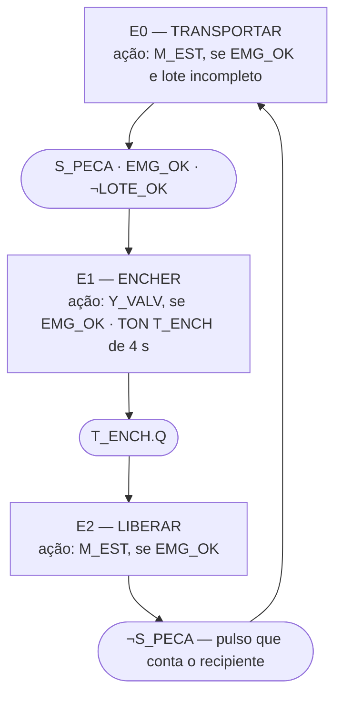

# TP07 — Programação sequencial de CLP

**Autor:** Marcelo Antonio Pereira Marcolino — USJT — ESO1AN-MCE3 
**Estado:** programas construídos e verificados no próprio simulador — 304/304 casos com esperado escrito antes da execução, conferência independente, 13/13 invariantes e 12/12 mutantes reprovados; os dois links públicos conferidos como visitante sem sessão 
**Data:** redação em 10 de outubro de 2026; execução nativa final em 11 de outubro de 2026, 01:44 UTC (10 de outubro, 22:44 em Brasília); verificação e capturas às 01:45 UTC; links conferidos às 06:25 UTC

## Links e artefatos

- **Programa A** — atraso de partida, sinal intermitente, lote de cinco peças
  e zeragem: <https://app.plcsimulator.online/bZeoImGrpquP33NSmiaX>. Abre com
  `STOP_OK` e `EMG_OK` em 1 (parada e emergência saudáveis), comandos e
  saídas em 0, CV = 0.
- **Programa B** — GRAFCET de enchimento convertido para Ladder:
  <https://app.plcsimulator.online/qeSrsSLhjVtkmcfWc0gZ>. Abre com `EMG_OK`
  em 1, nenhuma etapa ativa (a primeira varredura ativa E0), CV = 0.
- Os links abrem para visitantes sem login; a conta só é necessária para quem
  compartilha. Cada link é um retrato gravado no momento do compartilhamento:
  não acompanha edições posteriores.
- [`plc-simulator/p07-temporizacao-contagem.json`](plc-simulator/p07-temporizacao-contagem.json)
  e [`plc-simulator/p07-enchimento-grafcet.json`](plc-simulator/p07-enchimento-grafcet.json)
  — backups fiéis dos dois programas, no formato nativo do simulador, com o
  comentário de cada rung. O ferramental de teste os carrega no simulador pela
  ação interna de importação da própria aplicação (`IMPORT_PROJECT`, a mesma
  que ela usa ao abrir um link), acionada pelo protocolo de depuração do
  Chrome; a interface em si não tem botão para importar arquivo. O
  interpretador independente executa os mesmos arquivos.
- [`casos_teste.csv`](casos_teste.csv) — 312 linhas: os 304 casos dos dois
  programas e os 8 passos da medição do TOF, cada um com ação, número de
  varreduras, tempo, esperado, obtido e situação.
- [`testes/casos-de-teste.md`](testes/casos-de-teste.md) — relatório legível
  de casos, invariantes e mutantes; [`testes/traco-pisca.csv`](testes/traco-pisca.csv)
  — os seis segundos do sinal intermitente, varredura a varredura;
  [`testes/eventos-lote.csv`](testes/eventos-lote.csv) — tabela de eventos do
  lote; [`testes/resultados.json`](testes/resultados.json) — SHA-256 de
  programas, casos, ferramentas e capturas, com datas UTC.
- [`evidencias/`](evidencias/) — 11 capturas da interface do simulador nos
  estados decisivos (ver *Capturas*).

Dois projetos em vez de um: a contagem do lote de cinco e a conversão do
GRAFCET usam as mesmas tags pedidas (`S_PECA`, `LOTE_OK`, `RESET_LOTE`) com
lotes de tamanhos diferentes (5 e 6). Separá-los mantém os nomes pedidos sem
colisão.

## Glossário

- **Varredura** — uma execução completa do programa, do primeiro ao último
  rung. No simulador, cada varredura vale 66 ms de tempo de temporizador.
- **PT, ET, Q** — tempo predefinido, tempo decorrido e saída do temporizador.
- **CV, PV, QU** — valor corrente, valor predefinido e saída do contador.
- **Borda de subida** — a varredura em que um sinal passa de 0 para 1; um
  pulso de borda dura uma varredura.
- **Etapa, transição, receptividade** — estado do GRAFCET, passagem entre
  estados e condição que libera a passagem.
- **Motor nativo** — o próprio PLC Simulator Online executando o programa;
  os valores "obtidos" vêm dele.
- **Interpretador independente** — programa próprio, escrito à parte, que lê
  o mesmo JSON e executa as mesmas sequências; precisa coincidir com o motor
  nativo leitura por leitura.
- **Mutante** — cópia do programa com um erro proposital, que os testes
  precisam reprovar.

## Objetivo

Levar para o PLC Simulator Online comportamentos que dependem de tempo, de
eventos e de estado, de modo que cada um possa ser visto na tela e conferido
por testes: um motor que só parte depois de uma espera, uma lâmpada que pisca
com a fase guardada em memória, uma contagem que reconhece cada peça uma
única vez, uma zeragem com regra de prioridade escrita e a passagem de uma
sequência GRAFCET de enchimento — transportar, encher, liberar — para
memórias de etapa, rungs de transição e rungs de ação, com temporizador e
contador.

## Plataforma e como ela conta o tempo

**PLC Simulator Online** (`app.plcsimulator.online`), a plataforma pedida. A
interface não exibe número de versão; a versão usada é identificada pelo
pacote da aplicação, `index-52YZHsrG.js`, em 10 e 11 de outubro de 2026. A
própria página indica que a ferramenta não é mais desenvolvida e aponta o
sucessor *studio.rungs.dev*; o simulador seguiu funcional e as contingências
(Virtual Labs, planilha de ciclos) não foram necessárias. Temporizadores
(`TON`, `TOF`, `TONR`), contadores (`CTU`, `CTD`, `CTUD`), comparadores e
bobinas SET/RESET estão disponíveis.

As regras abaixo foram lidas no código da aplicação e confirmadas pelos
testes — elas explicam os números de varreduras que aparecem nas tabelas:

- **O tempo anda 66 ms por varredura.** Cada varredura soma 66 ms ao ET de
  um TON habilitado, limitado a PT. Por isso Q sobe na varredura ⌈PT/66⌉, não
  exatamente em PT:

  | PT | Varredura em que Q sobe | Tempo de varredura correspondente |
  |---:|---:|---:|
  | 1000 ms | 16ª | 1,056 s |
  | 3000 ms | 46ª | 3,036 s |
  | 4000 ms | 61ª | 4,026 s |

  Pelo código, a interface dispara uma varredura a cada 66 ms enquanto a
  simulação está ligada, então em tempo real o atraso deve ficar perto de PT.
  Isso não foi medido aqui: os testes contam varreduras, não relógio. Se o
  navegador espaçar as varreduras — por exemplo, com a aba em segundo plano —
  os atrasos em tempo real se esticam na mesma proporção.
- **TOF com ET decrescente.** No TOF desta plataforma, enquanto a entrada está
  em 1 o ET fica em PT; quando ela cai, o ET **diminui** até 0 e Q cai junto
  (na varredura ⌈PT/66⌉ depois da queda). O ET mostra, portanto, o tempo que
  falta, e não o tempo decorrido. Os programas não usam TOF; o comportamento
  foi medido à parte (8/8 passos, ver *Validação*).
- **O contador reage à borda.** O `CTU` incrementa quando a energia do
  próprio bloco passa de 0 para 1. A zeragem é a sub-variável `R` do contador:
  com `R = 1` o CV vai a 0 e **domina** uma borda que chegue na mesma
  varredura — essa borda é descartada, não conta depois. `QU` indica CV ≥ PV.
- **Comparadores** (`EQU`, `GEQ`...) comparam duas variáveis numéricas; aqui
  `C_LOTE.CV` com `C_LOTE.PV`.
- **Parar a simulação executa uma varredura sem energia.** Bobinas comuns vão
  a 0 e o ET dos temporizadores zera; memórias SET/RESET e o CV dos contadores
  são mantidos. Os dois programas foram escritos e testados para retomar
  corretamente depois disso.
- **Comentários de rung não aparecem na tela.** O simulador guarda o
  comentário de cada rung junto com o projeto, mas a interface não o exibe.
  A conferência dos links confirmou que os comentários seguem no projeto
  aberto pelo visitante, iguais aos dos arquivos — só não aparecem na tela.
  Por isso os rungs estão comentados nas tabelas deste README, além de nos
  arquivos, e as tags têm nomes que dizem a função.

## Decisões de projeto

| Decisão | Motivo |
|---|---|
| Dois projetos separados (A e B) | as mesmas tags pedidas com lotes de 5 e de 6 colidiriam num projeto só |
| `START` habilita a espera enquanto estiver em 1, sem selo | é a lógica pedida para o atraso; soltar antes do fim cancela, soltar depois desliga |
| PT exatamente 3 s, 1 s e 4 s, como pedido | a quantização de 66 ms é da plataforma e fica documentada e testada na fronteira (45ª × 46ª varredura) |
| Pisca com dois TON, um por fase, e uma única bobina para a fase | cada troca exige a fase vigente e desliga o temporizador que terminou |
| Borda do sensor explícita, com a memória do valor anterior em SET/RESET | o pulso fica visível, e a memória retida evita recontar ao parar e religar a simulação |
| `LOTE_OK` por "maior ou igual" | o aviso continua aceso se passar do lote |
| A zeragem vence a contagem simultânea | é o comportamento do bloco desta plataforma; escolhido como regra e testado |
| Etapas em memórias SET/RESET, com inicialização no último rung | as etapas sobrevivem à parada da simulação; a varredura de inicialização não dispara transição nem ação |
| Transições calculadas em bits antes de mexer nas etapas | a sequência anda no máximo uma etapa por varredura |
| Lote atualizado entre a transição de saída e as demais | a contagem e o bloqueio já valem na mesma varredura (ver *Ordem dos rungs*) |
| `EMG_OK` nas ações e no tempo de enchimento, não nas etapas | a emergência para os movimentos sem apagar em que ponto a sequência estava |
| Esteira parada em E0 com o lote completo | andando, ela levaria recipientes vazios além da estação |

## Programa A — atraso de partida, sinal intermitente e lote

### Tags

| Tag | Classe | Para que serve | Começa em |
|---|---|---|---|
| `START` | entrada | pedido de partida; precisa ficar em 1 durante a espera | 0 |
| `STOP_OK` | entrada | botão de parada em repouso (1) ou acionado (0) | 1 |
| `EMG_OK` | entrada | botão de emergência em repouso (1) ou acionado (0) | 1 |
| `HAB_PISCA` | entrada | liga e desliga o sinalizador piscante | 0 |
| `S_PECA` | entrada | detector de peça passando | 0 |
| `RESET_LOTE` | entrada | recomeça a contagem | 0 |
| `MOTOR_DELAY` | saída | contator do motor de partida retardada | 0 |
| `LAMPADA` | saída | sinalizador piscante | 0 |
| `LOTE_OK` | saída | aviso de que as cinco peças já passaram | 0 |
| `T1` | TON | espera de 3 s antes de ligar o motor | ET 0 |
| `T_DESL`, `T_LIG` | TON | duração de cada fase do sinalizador, 1 s | ET 0 |
| `PISCA` | memória | fase em que o sinalizador está (1 = aceso) | 0 |
| `S_PECA_ANT` | memória SET/RESET | o que o detector mostrava na varredura anterior | 0 |
| `P_PECA` | memória | fica em 1 só na varredura em que uma peça aparece | 0 |
| `C_LOTE` | CTU | quantas peças já passaram; limite 5 | CV 0 |

Entradas `*_OK` estão em lógica positiva: 1 é a condição normal, por isso
aparecem como contatos normalmente abertos.

### Rungs comentados

| Rung | Lógica | Papel |
|---|---|---|
| A1 | `EMG_OK · STOP_OK · START` → TON `T1` | conta a espera; sem um dos três, T1 volta a ET = 0 e Q = 0 |
| A2 | `T1.Q` → `MOTOR_DELAY` | o motor liga quando a espera termina |
| A3 | `HAB_PISCA · ¬PISCA` → TON `T_DESL` | mede o tempo apagado |
| A4 | `HAB_PISCA · PISCA` → TON `T_LIG` | mede o tempo aceso |
| A5 | `HAB_PISCA · (¬PISCA·T_DESL.Q + PISCA·¬T_LIG.Q)` → `PISCA` | escolhe a próxima fase: acende quando o tempo apagado termina e fica acesa até o tempo aceso terminar |
| A6 | `PISCA` → `LAMPADA` | a lâmpada mostra a fase |
| A7 | `S_PECA · ¬S_PECA_ANT` → `P_PECA` | pulso de chegada de peça, calculado antes de atualizar a memória |
| A8 | `S_PECA` → SET `S_PECA_ANT` | registra que o detector estava em 1 |
| A9 | `¬S_PECA` → RESET `S_PECA_ANT` | registra que o detector estava em 0 |
| A10 | `RESET_LOTE` → `C_LOTE.R` | zeragem escrita antes do contador, para vencer uma contagem na mesma varredura |
| A11 | `P_PECA` → CTU `C_LOTE` | cada pulso soma uma peça |
| A12 | `C_LOTE.CV ≥ C_LOTE.PV` → `LOTE_OK` | acende o aviso e o mantém se passar do lote |

### Parte 1 — atraso de partida

O TON recebe energia enquanto `EMG_OK`, `STOP_OK` e `START` estão em 1; a
saída é o Q do temporizador. Não há selo: `START` funciona como pedido
mantido, e soltá-lo antes de PT cancela a partida. Retirar um permissivo
tira a energia do bloco, que zera ET e Q na mesma varredura; o rung seguinte
desliga a saída em seguida. Esperado escrito antes da execução; obtido no
motor nativo:

| Caso | Ação | Varreduras (tempo) | Esperado: ET, Q, saída | Obtido: ET, Q, saída |
|---|---|---:|---|---|
| T01 | START mantido por 2 s | 31 (2,046 s) | 2046, 0, 0 — saída 0 em todas | 2046, 0, 0 — confere em todas |
| T01b | START solto antes de PT | 1 | 0, 0, 0 | 0, 0, 0 |
| T02a | START mantido por 45 varreduras | 45 (2,970 s) | 2970, 0, 0 | 2970, 0, 0 |
| T02 | 46ª varredura com START | 1 (3,036 s acumulados) | 3000, 1, 1 | 3000, 1, 1 |
| T03 | STOP_OK = 0 com ET em 1320 | 1 | 0, 0, 0 | 0, 0, 0 |
| T03c | STOP liberado com START mantido | 1 | 66, 0, 0 — recomeça do zero | 66, 0, 0 |
| T03d | mais 45 varreduras com START mantido | 45 | 3000, 1, 1 — religa sem nova ação | 3000, 1, 1 |
| T04 | EMG_OK = 0 com a saída ligada | 1 | 0, 0, 0 | 0, 0, 0 |
| T05 | emergência liberada sem START | 60 | 0, 0, 0 em todas | 0, 0, 0 em todas |
| T05c | START mantido com a emergência acionada | 10 | 0, 0, 0 em todas | 0, 0, 0 em todas |
| T05d–T05e | emergência liberada com START mantido | 45 + 1 | 3000, 1, 1 na 46ª — religa sem nova ação | 3000, 1, 1 |
| I01a–I01c | START por 40, solto por 1, START por mais 40 | 40 + 1 + 40 | 2640, 0, 0 — os tempos não se somam | 2640, 0, 0 |
| I02 | START solto depois de PT | 1 | 0, 0, 0 | 0, 0, 0 |
| I03 | STOP_OK = 0 com a saída ligada | 1 | 0, 0, 0 | 0, 0, 0 |

A fronteira entre T02a e T02 mostra a quantização do simulador: com 45
varreduras ainda falta tempo; a 46ª completa PT. Com START mantido, a volta
de STOP ou da emergência recomeça uma contagem completa e liga o motor depois
de 3 s (T03d, T05e) — partida por nível, declarada nos limites.

### Parte 2 — sinal intermitente

`PISCA` guarda a fase: 0 apagada, 1 acesa. Cada fase tem o seu TON de 1 s, e
uma única bobina decide a próxima fase. Ao habilitar, a lâmpada começa
apagada; a cada 16 varreduras (1,056 s, a quantização de 1 s) a fase troca.
Nos 6 s registrados (91 varreduras, 6,006 s) as trocas ocorreram exatamente
nas varreduras previstas pela fórmula escrita antes da execução:

| Varredura | Tempo | Troca | Lâmpada depois |
|---:|---:|---|---|
| 16 | 1,056 s | apagada → acesa | 1 |
| 32 | 2,112 s | acesa → apagada | 0 |
| 48 | 3,168 s | apagada → acesa | 1 |
| 64 | 4,224 s | acesa → apagada | 0 |
| 80 | 5,280 s | apagada → acesa | 1 |

A primeira fase apagada dura 15 varreduras porque a contagem começa na própria
varredura da habilitação; as seguintes duram 16. O traço completo, com ET e Q
dos dois temporizadores, está em [`testes/traco-pisca.csv`](testes/traco-pisca.csv)
(91/91 leituras conforme o esperado).

**Por que a fase não troca duas vezes seguidas.** Três cuidados juntos:

1. **A fase vigente faz parte da condição.** Acender exige `¬PISCA` e o fim
   do tempo apagado; continuar acesa exige `PISCA` e o tempo aceso ainda
   correndo. Depois da troca, a condição que a provocou deixa de valer.
2. **A troca desliga o temporizador que terminou.** A energia de `T_DESL`
   inclui `¬PISCA` e a de `T_LIG` inclui `PISCA`; na varredura seguinte à
   troca, o temporizador da fase anterior fica sem energia e seu Q cai.
3. **`PISCA` é escrita num lugar só.** Não há um SET num rung e um RESET em
   outro, cada um lendo o resultado do outro na mesma varredura.

O mutante MUT-A2 mostra o erro evitado: com um único temporizador sem fase e
a troca comandada pelo nível do Q, a lâmpada passa a trocar a cada varredura
depois do primeiro segundo — reprovado no traço de 6 s e no invariante
"PISCA não troca em duas varreduras seguidas".

### Parte 3 — lote de cinco peças

A chegada da peça é detectada explicitamente: `P_PECA = S_PECA · ¬S_PECA_ANT`,
calculada **antes** de atualizar a memória do valor anterior. O pulso dura
uma varredura e alimenta o CTU (PV = 5); `LOTE_OK` vem do comparador CV ≥ PV.
Cada peça ficou três varreduras com o detector em 1:

| Peça | Pulsos de chegada | CV depois | LOTE_OK |
|---:|---:|---:|---:|
| 1 | 1 | 1 | 0 |
| 2 | 1 | 2 | 0 |
| 3 — detector preso em 1 por 101 varreduras | 1 | 3 | 0 |
| 4 | 1 | 4 | 0 |
| 5 | 1 | 5 | 1 |
| 6 | 1 | 6 | 1 |

A tabela de eventos completa, passo a passo, está em
[`testes/eventos-lote.csv`](testes/eventos-lote.csv). Três mutantes mostram
por que cada escolha importa:

- **MUT-A3 — memória atualizada antes do pulso.** Com os rungs de
  `S_PECA_ANT` antes do rung do pulso, a memória já vale 1 quando o pulso é
  calculado: nenhuma peça é contada (reprova em L1a e em 80 casos).
- **MUT-A4 — contagem por nível.** Somando 1 a cada varredura com o detector
  em 1, uma peça vale três contagens e o detector preso dispara a contagem
  (reprova em L1b, L3b e em 87 casos).
- **MUT-A5 — igualdade em vez de "maior ou igual".** Com `EQU`, a sexta peça
  apaga `LOTE_OK`; com `GEQ`, o aviso continua aceso (reprova em L6a).

### Parte 4 — zeragem com prioridade explícita

**Regra: a zeragem vence.** A bobina de `C_LOTE.R` está antes do contador;
se o reset e uma chegada de peça caem na mesma varredura, o CV fica em 0, e
essa peça **não é contada depois**.

| Caso | Situação | Esperado | Obtido |
|---|---|---|---|
| R01 | reset com CV = 0 | CV = 0, LOTE_OK = 0 | igual |
| R02 | reset com CV = 3 | CV = 0 | igual |
| R03 | reset com CV = 5 e LOTE_OK = 1 | CV = 0, LOTE_OK = 0, QU = 0 | igual |
| R06-a | primeira peça depois do reset | CV = 1 | igual |
| R04 | peça e reset na mesma varredura, com CV = 4 | pulso presente, CV = 0, LOTE_OK = 0 | igual |
| R04b | reset solto com a peça ainda no detector | CV continua 0 | igual |
| R05 | reset mantido enquanto duas peças passam; depois solto | CV = 0 o tempo todo; a peça seguinte faz CV = 1 | igual |

Sem a prioridade — MUT-A6, zeragem escrita depois do contador — a peça de R04
seria contada (CV = 5, `LOTE_OK = 1`) antes de o reset agir na varredura
seguinte.

### Parada e retomada da simulação

Com o motor em espera, o pisca aceso e a quinta peça ainda no detector,
parar a simulação (PA1) zerou ET, `PISCA`, `LAMPADA` e `LOTE_OK`, mas manteve
CV = 5 e `S_PECA_ANT = 1`. Ao retomar (PA2), `LOTE_OK` voltou a 1 e **não
houve contagem a mais**. Isso depende da memória SET/RESET: o mutante MUT-A7
alimenta o CTU direto pelo nível de `S_PECA`. Como o contador desta
plataforma já detecta a borda, MUT-A7 passa em todos os outros casos — e só
reprova em PA2, onde conta a mesma peça de novo (CV = 6), porque a varredura
de parada zerou o valor anterior da alimentação do bloco.

## Programa B — GRAFCET de enchimento em Ladder

### O processo, em palavras próprias

A esteira leva recipientes até a estação. Quando um recipiente chega ao
detector, a esteira para e o bico abre por 4 s. Depois, a esteira volta a
andar para tirá-lo dali; a saída dele do detector soma uma unidade ao lote.
Com seis recipientes, `LOTE_OK` acende e nenhum novo ciclo começa até a
zeragem do lote. A emergência para a esteira e fecha o bico.

### GRAFCET

A etapa inicial é E0. As ações dependem da etapa ativa e de `EMG_OK`; a
esteira em E0 também depende de o lote não estar completo, porque com a
esteira andando um recipiente passaria pela estação sem ser enchido.

### Da sequência ao Ladder

| Elemento do GRAFCET | Como ficou no programa |
|---|---|
| cada etapa | uma memória SET/RESET: `E0_TRANSP`, `E1_ENCHER`, `E2_LIBERAR` |
| situação inicial | rung B13, o último: na primeira varredura, com `INIT = 0`, liga só E0 e marca `INIT` |
| cada transição | um rung que liga um bit (`TR01`, `TR12`, `TR20`) quando a etapa de origem está ativa e a condição de passagem vale |
| passagem de etapa | um rung que, com o bit da transição, liga a etapa de destino (SET) e desliga a de origem (RESET) |
| ações | um rung por saída, com a etapa e o permissivo na condição |
| tempo de enchimento | TON `T_ENCH`, alimentado por E1 · EMG_OK; o Q é a condição de E1 → E2 |
| contagem | CTU `C_LOTE` (PV = 6) alimentado por `TR20`; é o pulso de conclusão que o enunciado chama de `P_CONTAR` |

### Tags

| Tag | Classe | Para que serve | Começa em |
|---|---|---|---|
| `S_PECA` | entrada | detector de recipiente sob o bico | 0 |
| `EMG_OK` | entrada | botão de emergência em repouso (1) ou acionado (0) | 1 |
| `RESET_LOTE` | entrada | recomeça a contagem de recipientes | 0 |
| `M_EST` | saída | contator do motor que move a esteira | 0 |
| `Y_VALV` | saída | solenoide que abre o bico | 0 |
| `LOTE_OK` | saída | aviso de que seis recipientes já saíram | 0 |
| `E0_TRANSP`, `E1_ENCHER`, `E2_LIBERAR` | memórias SET/RESET | uma por etapa da sequência | 0 |
| `INIT` | memória SET | marca que a partida já foi feita | 0 |
| `TR01`, `TR12`, `TR20` | memórias | ficam em 1 só na varredura em que a passagem acontece | 0 |
| `T_ENCH` | TON | tempo de bico aberto, 4 s | ET 0 |
| `C_LOTE` | CTU | quantos recipientes deixaram a estação; limite 6 | CV 0 |

### Rungs comentados

| Rung | Lógica | Papel |
|---|---|---|
| B1 | `E2_LIBERAR · ¬S_PECA` → `TR20` | passagem E2 → E0; é o pulso que conta o recipiente |
| B2 | `RESET_LOTE` → `C_LOTE.R` | zeragem antes do contador: o reset vence |
| B3 | `TR20` → CTU `C_LOTE` | soma cada recipiente que sai |
| B4 | `C_LOTE.CV ≥ C_LOTE.PV` → `LOTE_OK` | aviso de lote, atualizado antes da condição de E0 → E1 |
| B5 | `E0_TRANSP · S_PECA · EMG_OK · ¬LOTE_OK` → `TR01` | passagem E0 → E1 |
| B6 | `E1_ENCHER · T_ENCH.Q` → `TR12` | passagem E1 → E2 |
| B7 | `TR01` → SET E1, RESET E0 | executa E0 → E1 |
| B8 | `TR12` → SET E2, RESET E1 | executa E1 → E2 |
| B9 | `TR20` → SET E0, RESET E2 | executa E2 → E0 |
| B10 | `E1_ENCHER · EMG_OK` → TON `T_ENCH` | tempo de bico aberto; a emergência zera a contagem |
| B11 | `EMG_OK · (E0_TRANSP · ¬LOTE_OK + E2_LIBERAR)` → `M_EST` | esteira: leva em E0, libera em E2 |
| B12 | `EMG_OK · E1_ENCHER` → `Y_VALV` | bico: só em E1 e sem emergência |
| B13 | `¬INIT` → SET E0, RESET E1, RESET E2, SET INIT | partida: na primeira varredura, só E0 fica ativa |

### Ordem dos rungs

- **Todas as transições usam as etapas do começo da varredura**, e só depois
  as etapas mudam. Assim a sequência anda no máximo uma etapa por varredura.
- **A inicialização fica no último rung.** Na primeira varredura nenhuma
  etapa está ativa quando transições e ações são avaliadas, então nada se
  move; E0 é ligada no fim, e a sequência começa a agir na segunda varredura
  (G00, GI0–GI1). Com isso, nenhuma etapa recebe SET e RESET na mesma
  varredura: a inicialização age sozinha, e numa sequência linear com uma
  única etapa ativa as passagens nunca disputam a mesma memória.
- **O lote é atualizado entre a transição de saída e as demais.** A contagem
  do recipiente que acabou de sair acontece na mesma varredura da passagem
  E2 → E0, e `LOTE_OK` já vem atualizado quando a condição de E0 → E1 e a
  ação da esteira são avaliadas. O mutante MUT-B5, com o lote calculado
  depois das etapas, erra em dois pontos: na zeragem com um recipiente
  aguardando, a esteira recebe um comando de uma varredura antes de o
  enchimento começar (G11); e, depois de parar e religar a simulação com o
  lote completo, um sétimo recipiente começa a ser enchido (G51).
- **Uma bobina por saída.** O mutante MUT-B2, com `M_EST` escrita em dois
  rungs, deixa a esteira parada em E0, porque o segundo rung sobrescreve o
  primeiro.

### Traço do ciclo normal

| Momento | Passo | O que aconteceu | Etapa | M_EST | Y_VALV | T_ENCH.ET | CV |
|---|---|---|---|---:|---:|---:|---:|
| carga do projeto | G00 | primeira varredura: só inicializa | E0 | 0 | 0 | 0 | 0 |
| esteira vazia | G01 | da segunda varredura em diante | E0 | 1 | 0 | 0 | 0 |
| recipiente detectado | G02 | `TR01` | E1 | 0 | 1 | 66 | 0 |
| meio do enchimento | G03 | 59 varreduras depois | E1 | 0 | 1 | 3960 | 0 |
| fim do tempo | G04 | 61ª varredura em E1 | E1 | 0 | 1 | 4000 | 0 |
| esteira volta | G05 | `TR12` | E2 | 1 | 0 | 0 | 0 |
| recipiente deixa o detector | G07 | `TR20` soma o recipiente | E0 | 1 | 0 | 0 | 1 |
| pronto para o próximo | G08 | | E0 | 1 | 0 | 0 | 1 |

O bico fica aberto por 61 varreduras (4,026 s). O segundo ciclo termina com
CV = 2. No lote completo, a sexta saída leva a E0 com `LOTE_OK = 1` e
`M_EST = 0`; com um recipiente na estação por 70 varreduras a sequência
continua em E0 sem abrir o bico (G10). A zeragem (G11) apaga `LOTE_OK` e,
com o recipiente já no detector, começa o enchimento na mesma varredura; a
saída desse recipiente é a primeira do novo lote (G12, CV = 1).

### Situações de falha

| Situação provocada | Caso | O que o programa fez (igual ao previsto) |
|---|---|---|
| emergência em E0, com um recipiente chegando | G20, G21 | esteira parada; o recipiente só começou a ser enchido na liberação (G22) |
| emergência em E1 | G23 | bico fechado, ET de volta a 0, E1 ainda marcada |
| emergência mantida em E1 | G23b | 50 varreduras sem o tempo avançar e sem sair de E1; `T_ENCH.ET` mostra o progresso |
| emergência liberada em E1 | G24 | bico reaberto; os 4 s recomeçaram do zero |
| emergência logo depois de o tempo se completar | G28 | passou a E2 mesmo assim — o enchimento já estava completo —, com a esteira parada até a liberação (G29) |
| emergência em E2 | G25 | esteira parada, E2 ainda marcada |
| recipiente retirado à mão durante a emergência em E2 | G26 | contado; volta a E0 com a esteira parada até a liberação (G27) |
| detector preso em 1 depois do enchimento | G30 | 200 varreduras em E2, esteira ligada tentando tirar o recipiente, sem contar |
| lote completo e recipiente na estação | G10 | nada se move: E0 sem esteira e sem bico |
| zeragem durante o enchimento | G40 | CV vai a 0 e o enchimento continua |
| zeragem na mesma varredura em que um recipiente sai | G41 | volta a E0 com CV = 0; esse recipiente não é contado depois |
| zeragem mantida durante um ciclo inteiro | GX12–GX16 | o ciclo segue normalmente e fecha sem contar; `LOTE_OK` fica em 0 |
| partida com um recipiente já no detector | GI0–GI1 | a primeira varredura só inicializa; na segunda, o recipiente começa a ser enchido |
| parar e retomar a simulação | G50–G53 | etapas e CV mantidos; com o lote completo, nada de sétimo enchimento; em E1, o bico reabre e o tempo recomeça |

## Validação

**Método.**

1. **Esperado escrito antes de cada execução.** Os esperados estão escritos
   como dados nos casos de teste do repositório de trabalho, derivados das
   regras da plataforma (66 ms por varredura, Q na varredura ⌈PT/66⌉,
   contador por borda com reset vencendo, varredura de parada) e da regra de
   cada parte. Nenhum valor esperado foi copiado de uma execução; a única
   tabela calculada — o sinal intermitente, varredura a varredura — vem de
   uma fórmula escrita na especificação antes da primeira execução.
2. **Obtido do motor nativo do simulador.** Cada programa é carregado pela
   ação interna de importação da aplicação; cada entrada é escrita pela ação
   da aplicação que muda o valor de uma tag; cada varredura liga a simulação,
   executa um ciclo e desliga; o passo "parar" executa a varredura sem
   energia, como a interface faz. Depois de cada varredura são lidas todas as
   tags observadas (entradas, saídas, memórias, ET e Q, CV e QU). O executor
   não escreve resultados: só lê o que o simulador calculou.
3. **Conferência independente.** Um interpretador próprio lê o mesmo JSON e
   executa as mesmas sequências; o obtido nativo e o dele precisam ser
   idênticos em todas as leituras. Ele foi escrito à parte, mas a partir das
   mesmas regras lidas no código da aplicação — confere o executor e o motor,
   não a leitura das regras.
4. **Invariantes**, vigiados em toda varredura com a simulação ligada.
5. **Mutantes**, que precisam reprovar pelo menos onde devem.

| Programa | Grupo | Casos | Varreduras | Resultado |
|---|---|---:|---:|---:|
| A | atraso de partida (T01–T05 e interrupções) | 24 | 458 | 24/24 |
| A | sinal intermitente | 3 | 108 | 3/3 (91 + 16 leituras varredura a varredura) |
| A | lote de cinco peças | 18 | 128 | 18/18 |
| A | zeragem | 59 | 97 | 59/59 |
| A | parada e retomada | 16 | 42 | 16/16 |
| B | ciclo normal e lote | 64 | 672 | 64/64 |
| B | falhas | 25 | 480 | 25/25 |
| B | comportamentos declarados nos limites | 16 | 190 | 16/16 |
| B | zeragem | 30 | 267 | 30/30 |
| B | parada e retomada | 49 | 439 | 49/49 |
| **A + B** | | **304** | | **304/304** |
| — | medição do TOF (fora dos programas) | 8 | 62 | 8/8 |

As varreduras da tabela somam só os casos. Os passos de preparo, também
conferidos, completam 846 varreduras em A (13 de preparo) e 2055 em B (7). As
invariantes não contam as varreduras de parada (1 em A, 2 em B) nem, em B, a
varredura de inicialização de cada sequência (9), em que as ações rodam antes
de E0 ser ligada: daí 845 e 2044.

| Invariante | Descrição | Violações |
|---|---|---:|
| INV-A1 | `MOTOR_DELAY = T1.Q` | 0 |
| INV-A2 | `T1.Q = 1` se e somente se `T1.ET = 3000` | 0 |
| INV-A3 | `LAMPADA = PISCA` | 0 |
| INV-A4 | `P_PECA` nunca em 1 em duas varreduras seguidas | 0 |
| INV-A5 | `LOTE_OK = (CV ≥ 5) = C_LOTE.QU` | 0 |
| INV-A6 | `PISCA` não troca em duas varreduras seguidas | 0 |
| INV-A7 | CV só sobe com `P_PECA = 1`, de 1 em 1, e só vai a 0 com `RESET_LOTE = 1` | 0 |
| INV-B1 | exatamente uma etapa ativa | 0 |
| INV-B2 | `Y_VALV = E1_ENCHER · EMG_OK` | 0 |
| INV-B3 | `M_EST = EMG_OK · (E0_TRANSP · ¬LOTE_OK + E2_LIBERAR)` | 0 |
| INV-B4 | `M_EST` e `Y_VALV` nunca juntos | 0 |
| INV-B5 | `LOTE_OK = (CV ≥ 6)` | 0 |
| INV-B6 | CV só sobe com `TR20 = 1`, de 1 em 1, e só vai a 0 com `RESET_LOTE = 1` | 0 |

| Mutante | Erro introduzido | Deve reprovar pelo menos em | Resultado |
|---|---|---|---|
| MUT-A1 | permissivos só na saída: STOP e emergência não zeram o temporizador | T03, T03c, T04 | reprovou nos três e em T03b, T05c, T05d e I03; INV-A1 violado |
| MUT-A2 | pisca com um TON sem fase, troca pelo nível do Q | P01 | reprovou e também em PA0b; INV-A6 violado |
| MUT-A3 | memória do valor anterior atualizada antes do pulso | L1a | reprovou em 80 casos (nenhuma contagem) |
| MUT-A4 | contagem por nível (soma 1 por varredura) | L1b, L3b | reprovou em 87 casos; INV-A5 e INV-A7 violados |
| MUT-A5 | `EQU` em vez de `GEQ` | L6a | reprovou e também em L6b; INV-A5 violado |
| MUT-A6 | zeragem escrita depois do contador | R04 | reprovou e também em R02, R03, R05a; INV-A7 violado |
| MUT-A7 | CTU alimentado direto pelo nível do detector | só PA2 | reprovou só em PA2, como previsto |
| MUT-B1 | condição de E0 → E1 sem o contato da etapa E0 | G06 | reprovou em 125 casos; INV-B1 e INV-B4 violados |
| MUT-B2 | `M_EST` escrita em duas bobinas | G01 | reprovou em 34 casos; INV-B3 violado |
| MUT-B3 | bico sem `EMG_OK` | G23 | reprovou e também em G23b; INV-B2 violado |
| MUT-B4 | zeragem escrita depois do contador | G40, G41 | reprovou nos dois e em G11, G12, G12a–G12c, G51b, G51c e GX12; INV-B6 violado |
| MUT-B5 | lote calculado depois das transições e das etapas | G11, G51 | reprovou nos dois e em G12, G12a–G12c e G51c |

Motor nativo e interpretador coincidiram em **19 160 de 19 160 leituras**
(todas as tags observadas, depois de cada varredura, no original, nos 12
mutantes e na medição do TOF). O registro
[`testes/resultados.json`](testes/resultados.json) traz o SHA-256 dos
programas, dos casos, dos mutantes, das ferramentas e das 11 capturas
(execução nativa de 2026-10-11T01:44:49Z; verificação e capturas de
2026-10-11T01:45:15Z). SHA-256 dos programas entregues:

- `p07-temporizacao-contagem.json`: `a361d89b47c48c177c74b34c44f2a7b418377bb50b19239f73f7bc10e1748e8e`
- `p07-enchimento-grafcet.json`: `6339b6a66de3df54d858add170fda7d1cd4d6ba886122c243bb880ccc596980e`

**Histórico das execuções.** Houve quatro execuções completas no motor
nativo, todas aprovadas nos casos que existiam em cada uma; antes de cada
uma, os casos novos ou alterados foram escritos sem consultar resultados:

1. 01:17 UTC — 278 casos, todos aprovados.
2. 01:28 UTC — mais 3 casos (T05c–T05e), para provar uma frase dos limites
   sobre a emergência liberada com START mantido.
3. 01:42 UTC — depois da revisão adversarial: a inicialização do programa B
   foi movida para o último rung, o que mudou o esperado da primeira
   varredura (`M_EST = 0`) e o caso mínimo de MUT-B2 (G01); entraram os
   casos de partida com recipiente, de emergência logo após o tempo e dos
   comportamentos declarados nos limites; o comentário do rung A5 foi
   reescrito e os rótulos de grupo dos casos foram renomeados. Os 304 casos passaram; um
   invariante acusou a varredura de inicialização, e a regra dos invariantes
   de B passou a excluí-la (explicada acima).
4. 01:44 UTC — mesma execução, com o texto do invariante atualizado nos
   casos; é a registrada em `resultados.json`.

**Conferência dos links.** Cada link público foi aberto em contexto de
navegador sem cookies nem sessão, como um visitante. A forma normalizada do
projeto carregado pela própria aplicação — rungs em ordem com seus
comentários, ramos, tipo de cada elemento, tags de cada parâmetro por nome e
tabela de tags com tipo e tag-mãe — precisa ser idêntica à do JSON entregue,
com os mesmos valores em todas as tags, e a leitura é repetida 1,5 s depois
para confirmar que ficou estável; a forma de cada mutante precisa diferir da
do original, para provar que a comparação discrimina. Resultado de
2026-10-11T06:25Z, nos dois links: estrutura idêntica (A: 12 rungs e 39 tags;
B: 13 rungs e 28 tags), valores idênticos, leitura estável e forma distinta da
de todos os 12 mutantes.

## Capturas

A tabela de tags à esquerda mostra o valor de cada tag booleana; os blocos
mostram PT e ET dos temporizadores e PV e CV dos contadores. Um bloco de
temporizador ou de contador fica cinza enquanto Q (ou QU) é 0 — inclusive
contando — e verde quando é 1. O quadrado vermelho no alto, à direita, indica
a simulação ligada. Cada captura foi tirada no estado alcançado pelos mesmos
passos dos casos de teste, com o relógio de varredura da interface suspenso
durante a foto, para que o estado não avançasse; só foi gravada depois de
conferir que o estado ficou estável, que a tabela exibida é igual ao estado
do simulador e que as tags decisivas têm os valores do caso.

| Arquivo | Estado | Caso |
|---|---|---|
| [`01-ton-contando.png`](evidencias/01-ton-contando.png) | START mantido, T1 com ET = 2970, `MOTOR_DELAY = 0` | T02a |
| [`02-ton-concluido.png`](evidencias/02-ton-concluido.png) | ET = PT = 3000, Q = 1, `MOTOR_DELAY = 1` | T02 |
| [`03-stop-zera.png`](evidencias/03-stop-zera.png) | `STOP_OK = 0` durante a espera: ET = 0 | T03 |
| [`04-pisca-aceso.png`](evidencias/04-pisca-aceso.png) | fase acesa: `PISCA = LAMPADA = 1`, `T_LIG.ET = 528` | P01, 24ª varredura |
| [`05-pisca-apagado.png`](evidencias/05-pisca-apagado.png) | fase apagada: `PISCA = LAMPADA = 0`, `T_DESL.ET = 528` | P01, 40ª varredura |
| [`06-lote-completo.png`](evidencias/06-lote-completo.png) | quinta peça com o detector mantido: CV = 5, `LOTE_OK = 1`, `P_PECA = 0` | L5b |
| [`07-reset-simultaneo.png`](evidencias/07-reset-simultaneo.png) | peça e reset na mesma varredura: pulso presente, CV = 0 | R04 |
| [`08-e1-enchendo.png`](evidencias/08-e1-enchendo.png) | E1 ativa, bico aberto, ET = 3960 | G03 |
| [`09-e2-liberando.png`](evidencias/09-e2-liberando.png) | E2 ativa, esteira tirando o recipiente do detector | G06 |
| [`10-lote-bloqueado.png`](evidencias/10-lote-bloqueado.png) | CV = 6, `LOTE_OK = 1`, recipiente na estação e nada se move | G10 |
| [`11-emergencia-e1.png`](evidencias/11-emergencia-e1.png) | `EMG_OK = 0` em E1: bico fechado, ET = 0, E1 mantida | G23 |

Anúncios da página foram ocultados na captura por CSS local e avisos foram
fechados; o programa e os valores não foram alterados. O verde de um contato
indica a condição daquele contato, e o de uma bobina SET/RESET indica o valor
da tag.

## Como reproduzir

1. **No simulador:** abra o link do programa (acima) e ligue a
   simulação (último botão da barra de ferramentas). Com a simulação ligada,
   um clique no contato de uma entrada alterna a tag, que não volta sozinha.
   - Programa A: clique em `START` (vai a 1) e espere cerca de 3 s:
     `MOTOR_DELAY` acende; clique em `STOP_OK` e veja ET voltar a 0. Clique
     em `HAB_PISCA` para a lâmpada piscar. Clique em `S_PECA` duas vezes por
     peça (1 e depois 0): o CV sobe uma vez por peça, e com cinco `LOTE_OK`
     acende; `RESET_LOTE` em 1 zera o lote.
   - Programa B: ao ligar a simulação pela primeira vez depois de carregar o
     projeto, a primeira varredura ativa E0 e, da segunda em diante, a
     esteira anda. Clique em `S_PECA` (1): a esteira
     para e o bico abre por cerca de 4 s; depois a esteira volta. Clique de
     novo em `S_PECA` (0): o recipiente sai, CV sobe e a sequência volta a E0.
2. **A partir dos backups:** os JSON em `plc-simulator/` são cópias fiéis
   dos programas e podem ser lidos em qualquer editor de texto (rungs com
   comentário, elementos, ramos e tags) e conferidos pelo SHA-256 acima. Sem
   botão de importação na interface, o caminho para vê-los em execução é o
   link.
3. **No repositório de trabalho:** a geração dos programas e dos mutantes, a
   execução no motor nativo, o interpretador, o verificador e as capturas são
   ferramentas fora do pacote publicado, como nos TPs anteriores; o SHA-256
   de cada uma está em [`testes/resultados.json`](testes/resultados.json).

## Checklist de aceitação

| # | O que precisa estar demonstrado | Onde |
|---|---|---|
| 1 | o temporizador aparece pelos seus três números — limite, acumulado e bit de fim — e eles são conferidos nos testes | *Plataforma*; tabela da Parte 1; capturas 01–03 |
| 2 | uma peça soma um só ao contador, por mais tempo que fique sob o detector | Parte 3; L3b; INV-A4, INV-A7; MUT-A3 e MUT-A4 reprovados |
| 3 | está escrito, e testado, quem vence quando zeragem e contagem chegam juntas | Parte 4; R04, R05, G41; MUT-A6 e MUT-B4 reprovados |
| 4 | a sequência nunca fica com duas etapas ligadas, nem com nenhuma | INV-B1 sem violação; MUT-B1 reprovado |
| 5 | acionar a emergência para a esteira, fecha o bico e corta o motor | T04, G20–G29; INV-B2; MUT-A1 e MUT-B3 reprovados |
| 6 | a tabela de testes traz previsto, medido e veredito, para funcionamento e para falhas | [`casos_teste.csv`](casos_teste.csv) |
| 7 | cada rung tem o seu papel explicado | tabelas de rungs deste README; comentários nos JSON |
| 8 | as fontes estão declaradas, e o que não foi consultado é dito como tal | *Fontes* |
| 9 | cada link abre para um visitante sem login e mostra o programa entregue | links acima; *Conferência dos links*: estrutura, comentários e valores idênticos aos JSON, sem sessão |

## Conceitos usados

**Ligar com atraso e desligar com atraso.** Um TON segura a saída em 0 até
que a sua entrada tenha ficado em 1 pelo tempo PT inteiro; se a entrada cai
antes, a espera recomeça do zero na próxima vez. Um TOF faz o contrário com
o desligamento: a saída acompanha a entrada quando ela sobe, mas só volta a 0
depois de PT com a entrada em 0; se a entrada subir de novo no meio da
espera, a saída nem chega a cair.

**Memória que atravessa varreduras.** Muito do que o programa precisa saber
não está nas entradas daquele instante: em que fase está o sinalizador, o que
o detector mostrava antes, em que etapa a sequência parou. Bobinas SET e
RESET guardam essas informações: depois de ligada por um SET, a memória fica
em 1 até um RESET, mesmo que a condição que a ligou desapareça. Quando as duas
condições podem valer juntas, é preciso decidir qual vence e testar a
decisão; aqui os pares de SET e RESET nunca disputam a mesma memória na mesma
varredura, e no contador a zeragem vence.

**Contar peças, não varreduras.** O detector fica em 1 durante várias
varreduras enquanto a peça passa. Somar enquanto ele está em 1 contaria a
mesma peça muitas vezes; somar só na varredura em que ele muda de 0 para 1
conta uma vez por peça (MUT-A4). Para o aviso de lote, "maior ou igual" é a
comparação certa: o lote continua completo se chegar mais uma peça, e a
igualdade só valeria naquele instante (MUT-A5).

**Do GRAFCET ao Ladder.** A conversão preserva quatro coisas: cada etapa vira
uma memória, e só a inicial começa ligada; cada passagem só acontece a partir
da etapa de origem — sem esse contato, um recipiente parado no detector
religaria o enchimento no meio da liberação (MUT-B1); as etapas mudam todas a
partir do estado do começo da varredura; e cada saída depende da etapa ativa,
com o botão de emergência agindo nas saídas, e não nas memórias de etapa,
para que parar os movimentos não apague o ponto em que a sequência estava.

## Conclusão e limites da simulação

Os dois programas fazem o que foi pedido e foram verificados no próprio motor
do simulador contra um esperado escrito antes: a partida espera PT e é
cancelada por STOP, emergência ou queda de START; a lâmpada troca de fase uma
vez a cada fim de tempo; cada peça conta uma vez, mesmo com o detector preso;
a zeragem vence a contagem simultânea; e a sequência de enchimento mantém uma
única etapa ativa, bloqueia novos ciclos com o lote completo e para os
movimentos na emergência sem perder o estado. Os mutantes mostram que os
testes enxergam os erros clássicos: espera que não zera, troca de fase por
nível, contagem por nível, ordem errada de rungs, zeragem sem prioridade,
passagem fora da etapa e bobina duplicada.

Limites:

- É uma simulação **lógica**: sem hardware, E/S reais, ruído ou tempo de
  varredura real. O tempo do programa anda em passos de 66 ms de tempo de
  simulação, e os atrasos ficam até 66 ms acima de PT nessa escala; o tempo
  real não foi medido.
- **A emergência aqui não é função de segurança.** `EMG_OK` num programa de
  CLP comum apenas bloqueia comandos; uma emergência real exige dispositivo e
  circuito de segurança adequados. Como a lista de E/S pedida não tem botão
  de rearme, a liberação de `EMG_OK` retoma as ações sozinha (G22, G24, G27,
  G29); um sistema real exigiria rearme manual. No programa A, com START
  mantido, a volta de STOP ou da emergência religa o motor depois de 3 s
  (T03d, T05e).
- **Tempo de bico não retentivo.** Uma emergência em E1 zera a contagem e,
  ao liberar, o bico fica aberto mais 4 s inteiros (G24): o recipiente recebe
  mais de 4 s no total. Uma dose exata exigiria temporizador retentivo (o
  simulador oferece `TONR`), fora do pedido.
- **Sem conferência de presença durante o enchimento.** O GRAFCET pedido não
  prevê o recipiente sair do detector em E1: o bico continua aberto até o fim
  do tempo e, ao chegar a E2 com o detector livre, a sequência conta o
  recipiente retirado como concluído (GX2–GX5).
- **Sem filtro de repique.** Se o detector oscilar na saída (1 → 0 → 1), o
  recipiente é contado e o bico reabre sobre ele (GX10–GX11); no programa A,
  cada subida extra conta uma peça a mais.
- **Partida com recipiente presente.** Ao carregar o projeto, `INIT` está em
  0 e a primeira varredura faz a inicialização. Se nesse momento já houver um
  recipiente no detector, ele é enchido a partir da segunda varredura
  (GI0–GI1), mesmo que já tenha sido enchido antes: na carga inicial, o
  programa não tem como saber disso. Parar e retomar a simulação é outra
  situação: etapas, `INIT` e contagem são mantidos, e a sequência continua de
  onde estava (G50–G53).
- **O que a zeragem descarta.** No programa A, uma peça cuja chegada coincide
  com o reset, ou que passa com o reset mantido, não é contada (R04, R05). No
  programa B, um recipiente que sai com o reset ativo não é contado (G41,
  GX15); com `RESET_LOTE` mantido, `LOTE_OK` fica em 0 e os ciclos seguem sem
  contar (GX12–GX16).
- O ET do TOF desta plataforma mostra o tempo restante, não o decorrido.

## Fontes

- Material da disciplina Sistemas Automatizados, Semana 7 (programação
  sequencial de CLP), USJT, 2026 — enunciado da prática; os requisitos foram
  reescritos com palavras próprias e os nomes de tags pedidos foram mantidos.
- PLC Simulator Online: textos da própria interface (inclusive a indicação do
  sucessor) e código da aplicação (`index-52YZHsrG.js`), lidos em 10 de
  outubro de 2026 para levantar as regras do motor descritas em
  *Plataforma*; as regras foram confirmadas pela execução nativa.
- Não consultados diretamente: a norma IEC 61131-3, a documentação antiga do
  simulador e o Virtual Labs, indicados no material da disciplina. Nada neste
  README depende deles.
